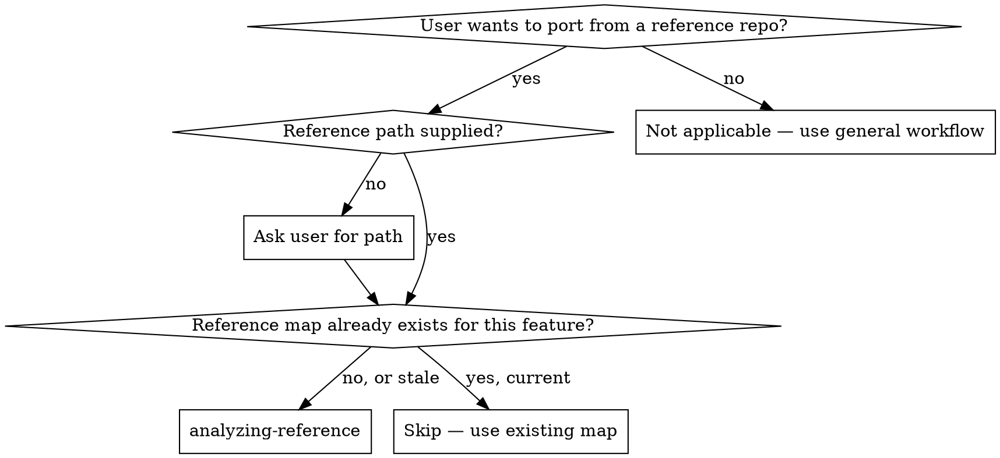

# Analyzing a Reference Repository

## Overview

Deep-read a reference repo at the path the user supplied (absolute, relative, or a checkout inside the project) and produce a **reference map** — the structured artifact that `distillation-design`, `distillation-plan`, and `distillation-execution` consume.

The path captured in the reference map's `Reference path` field is the single source of truth for the reference's location. Every downstream skill resolves source files via that field — no hard-coded directory conventions.

This is the first step of the distillation flow, once porting intent and a reference path are present. Skipping it means downstream skills make decisions without evidence — and those decisions are usually wrong.

**Core principle:** The reference map is the contract. Every downstream skill quotes from it. If something isn't in the map, the downstream skills don't see it.

**Announce at start:** "I'm using `analyzing-reference` to map the reference repo."

**Type:** Flexible (adapt the techniques to the language), but the **output structure is rigid**.

## When to Use



## Inputs

Before invoking, you must have:

1. **Path to a reference repo:** any directory on disk that contains the reference. Absolute (`/Users/me/code/awesome-auth`), relative from the project root (`../awesome-auth`), or a checkout inside the project — all valid. Verify the path exists and contains a recognizable repo (manifest, source tree) before proceeding.
2. **Feature description:** a sentence or two naming what the user wants to port (e.g., "the OAuth login and token refresh flow", "the in-memory LRU cache").

If either is missing, ask the user — **one question at a time**, multiple-choice when possible. For the path, accept whatever they give you; do not insist on a particular layout.

Throughout this document, `<REF_PATH>` stands for the path the user supplied. Wherever an example uses a path like `/Users/me/code/awesome-auth/...`, treat it as `<REF_PATH>/...` resolved against the user's value.

## Output

A reference map written to `docs/distilling/<repo>-<feature-slug>-reference-map.md` in the user's project. This is a **working artifact**, not yet committed — `distillation-design` commits it together with the spec.

### Map structure

```markdown
# Reference Map: <repo> — <feature>

**Reference path:** <REF_PATH — exactly as the user gave it, absolute preferred>
**Reference repo URL:** <upstream URL if known; otherwise "local only">
**Source commit hash:** <hash from `git -C <REF_PATH> rev-parse HEAD`>
**Primary language:** <language>
**Test framework:** <e.g., jest, pytest, go test>

## Feature scope (user's words)
<one paragraph>

## Feature files

Paths in this section are RELATIVE to `<REF_PATH>`. Downstream skills join them
with the `Reference path` field above to read each file.

- path/to/file1.ts — <one-line summary>
- path/to/file2.ts — <one-line summary>

## Transitive deps inside the repo

| File (relative to <REF_PATH>) | Used by | must-take or can-stub? | Why |
| ------------------------------ | ------- | ---------------------- | --- |
| ... | ... | must-take / can-stub | ... |

## External libraries

| Library | Version constraint | Used for | Equivalent in target? |
| ------- | ------------------ | -------- | --------------------- |
| ... | ... | ... | (filled in during design) |

## Tests for the feature

Paths relative to `<REF_PATH>`.

- test/file1.test.ts — covers <what>
- test/file2.test.ts — covers <what>

## Entry points
How callers invoke the feature from outside:
- function/class/method/endpoint, with signature

## Hidden coupling
Globals, env vars, file paths, side effects, time/random sources, network calls, OS-specific behavior. Each item names the file (relative to `<REF_PATH>`) and line.

## Open questions for design
- <anything you couldn't resolve and need user input on>
```

**Path convention.** The `Reference path` field is the only absolute (or
user-supplied) path that appears in the map. Every other source-file path in
the map is relative to it. This keeps the map portable: if a teammate clones
the reference somewhere else, they update one field and everything still resolves.

## Checklist

Create one `TaskCreate` entry per item and complete in order.

1. **Confirm inputs** — the supplied path exists on disk and contains a recognizable repo (manifest / source tree). Record the path exactly as the user gave it (or normalize to absolute if they gave a relative path — do not silently change it). Feature description is present.
2. **Snapshot reference metadata** — top-level files at `<REF_PATH>`: README, package manifest, test config. Record source commit hash (`git -C <REF_PATH> rev-parse HEAD`).
3. **Locate the feature** — search files by user's keywords + manifest entry points; deep-read candidates; confirm with the user if multiple plausible matches.
4. **Walk transitive deps inside the repo** — for every feature file, trace imports recursively. Stop at the repo boundary. Mark each dep `must-take` or `can-stub`.
5. **List external libraries** — distinct from stdlib. Note version constraints.
6. **Find tests** — locate test files exercising the feature files. Identify the test framework.
7. **Identify entry points** — how callers invoke the feature.
8. **Surface hidden coupling** — globals, env vars, file IO, network, time, random, OS-specific calls inside the feature subgraph.
9. **Write the reference map** to `docs/distilling/<repo>-<feature-slug>-reference-map.md`.
10. **Self-review** — see below.
11. **Hand off** — announce: "Reference map written to `<path>`. Invoking `distillation-design` next."

## How to do the work

### Locating the feature

If the user's description is fuzzy (e.g., "the search part"), pick the most plausible entry points from the README or the manifest's `main`/`bin`/`exports`, follow them, and **confirm with the user before committing to a scope**. One question at a time.

### Walking transitive deps

Use language-appropriate import resolution:

- **TypeScript/JavaScript:** `import` / `require`, follow paths from `tsconfig.json` / `package.json`.
- **Python:** `import` / `from ... import`, follow into the repo's package directories.
- **Go:** package imports, follow within the module.
- **Rust:** `use` statements, follow within the crate.
- **Other:** follow the language's import mechanism. If unfamiliar, ask the user to point you at the entry file.

Stop tracing the moment you cross the repo boundary into external libraries — those go in the **External libraries** section, not transitive deps.

### Marking deps `must-take` vs `can-stub`

- **must-take:** the feature's behavior on its **normal paths** depends on this file. Without it, ported tests will fail.
- **can-stub:** the file is imported but only used in error paths, debug paths, or features outside the user's scope. A trivial stub or an empty default keeps the port working.

When in doubt, mark `must-take`. The design skill can downgrade later with evidence.

### Hidden coupling — what to look for

Almost no real feature has zero hidden coupling. Look for:

- Module-level mutable state (`let cache = ...` at top level, class-level statics).
- `process.env`, `os.environ`, runtime feature flags.
- Reads/writes to specific files or directories.
- Network calls (HTTP, sockets).
- `Date.now()`, `time.time()`, `random()`, `crypto.randomBytes()`.
- Threading, asyncio, event-loop assumptions.
- Platform-specific syscalls or path conventions.

Each item is a decision the design step has to make. Surface it so the design step can resolve it.

## Examples

<Good>
```markdown
## Hidden coupling

(Reference path: /Users/me/code/awesome-auth — all paths below are relative.)

- src/oauth.ts:42 — reads `process.env.OAUTH_CLIENT_SECRET` directly.
- src/refresh.ts:88 — calls `Date.now()` for token expiry comparison.
- src/state.ts:15 — module-level `Map<string, Session>` cache; not cleared between requests.
- src/oauth.ts:120 — uses `fetch` to hit `https://example.com/oauth/token`.
```
Concrete: file (relative to the reference path), line, what's coupled.
</Good>

<Bad>
```markdown
## Hidden coupling

- Some env vars are read.
- There's a global cache somewhere.
- Network calls happen.
```
Vague. Design step has nothing to resolve.
</Bad>

## Common Rationalizations

| Excuse | Reality |
|--------|---------|
| "The reference is well-known, I know the deps" | Document them anyway. Downstream skills don't share your memory. |
| "I'll skip transitive deps, just take the top file" | Top file imports things. Those things have to exist in the target. |
| "I'll figure out hidden coupling during the port" | You won't. The design step needs them up front to pick modes. |
| "Tests aren't relevant to the map" | They're the spec for `equivalence-tdd`. Name the files. |
| "I'll come back and add deps later" | "Later" never comes. The map drives the spec; missing deps = missing spec rows. |

## Red Flags - STOP

- Reference map lists only the entry file (no transitive deps).
- Hidden coupling section is empty (almost no real feature is this clean).
- Tests section says "the repo has tests" without listing them.
- Map includes **opinions** on how to port — out of scope; that belongs in `distillation-design`.
- "Open questions" section is missing entirely (every analysis surfaces at least one).

## Self-Review

After writing the map, scan with fresh eyes:

1. **Placeholder scan:** any TBD/TODO/vague entries? Fix inline.
2. **Internal consistency:** every file listed under **Feature files** is reachable from an **Entry point**. Every dep listed under **Transitive deps** is imported (directly or transitively) by a feature file.
3. **Commit sanity:** source commit hash is a full SHA, not "main" or "HEAD".
4. **Open questions:** explicitly listed. If you have zero open questions, you probably missed something — look again.

Fix issues inline. No re-review loop.

## What you do NOT do

- You do **not** decide what to copy / port / rewrite. That's `distillation-design`.
- You do **not** modify any file under the reference path. The reference is read-only, wherever it lives.
- You do **not** copy the reference into the user's project (or any other location). Read it in place at `<REF_PATH>`.
- You do **not** write code in the target project. You produce a document.

## When the reference is poor

If the reference has no tests, no clear feature boundary, or a broken build: **stop and report this to the user before writing the map.** They may choose a different reference, a different feature, or accept the limitations explicitly.

## Why this matters

Every downstream skill quotes the reference map:

- `distillation-design` picks per-chunk modes from the dependency graph and hidden coupling.
- `distillation-plan` builds the source→target file map from the feature-files list.
- `distillation-execution`'s implementer subagent reads source files at the recorded commit hash.

A vague map produces a vague spec, which produces a vague plan, which produces a port nobody can audit. Be specific here — every other skill depends on it.
