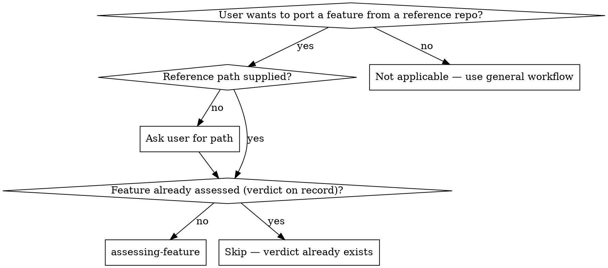

# Assessing a Feature

## Overview

A **pre-flight gate**. Before the flow spends effort mapping a reference (`analyzing-reference`) and designing a port, take a focused technical read of the feature and decide: **is this design good enough to bring into the user's project?**

This skill answers one question — *should we distill this at all?* — by reading how the feature is **architected**, how it is **implemented**, and what **algorithm / approach** it uses, then issuing a verdict. It is the cheap triage that stops a doomed port before the expensive mapping begins.

It is deliberately lighter than `analyzing-reference`. You read the core feature files to judge their quality, NOT to exhaustively trace every transitive dependency. The full dependency walk happens later, only if the verdict is GO.

**Core principle:** The verdict gates the flow. A NO-GO here saves the user from porting code they'll regret. A clear GO gives every downstream skill confidence the source is worth the discipline.

**Announce at start:** "I'm using `assessing-feature` to judge whether this feature is worth distilling."

**Type:** Flexible (adapt the reading techniques to the language and feature), but the **verdict and output structure are fixed**.

## When to Use



## Inputs

Before invoking, you must have:

1. **Path to a reference repo** — any directory on disk containing the reference. Absolute, relative, or a checkout inside the project. Verify the path exists and contains a recognizable repo before proceeding.
2. **Feature description** — a sentence or two naming what the user wants to bring in (e.g., "the rate-limiter middleware", "the diff algorithm").

If either is missing, ask the user — **one question at a time**, multiple-choice when possible.

Throughout this document, `<REF_PATH>` stands for the path the user supplied.

## Output

An assessment written to `docs/distilling/<repo>-<feature-slug>-assessment.md` in the user's project. This is a **working artifact** committed by this skill (the verdict is a decision worth recording on its own, even if the flow stops here).

### Assessment structure

```markdown
# Feature Assessment: <repo> — <feature>

**Reference path:** <REF_PATH — exactly as the user gave it, absolute preferred>
**Source commit hash:** <hash from `git -C <REF_PATH> rev-parse HEAD`>
**Primary language:** <language>
**Feature scope (user's words):** <one or two sentences>
**Files read for this assessment:** <the handful of core files you actually read, relative to <REF_PATH>>

## Architecture
How the feature is structured: the main components, how they relate, where the
boundaries sit, what the data/control flow looks like. Is the structure clean
and comprehensible, or tangled? Cite files and lines.

## Implementation
How the code is written: readability, idiom quality, error handling, edge-case
coverage, state management. Is it code you'd be glad to own, or a liability?
Cite concrete examples — good and bad.

## Algorithm / approach
The core technique. What is the key idea? Is it sound, naive, or clever? Are
there known better approaches? Is the value in this code, or could the idea be
re-derived cheaply? Cite the file(s) where the core logic lives.

## Distillability signals
Quick read (not the full map): does the feature have tests? Is it tightly
coupled to reference-specific infrastructure (frameworks, DI, globals)? Roughly
how self-contained is it? These shape the verdict but are confirmed later by
analyzing-reference.

## Verdict

**VERDICT: GO | NO-GO | REWRITE-FROM-SCRATCH**

Reasoning: <2–4 sentences tying the verdict to the sections above. If REWRITE,
name what is worth learning vs. what should be dropped. If NO-GO, name the
disqualifier.>
```

## The Verdict

Exactly one of three:

- **GO** — architecture, implementation, and algorithm clear the bar. The code is worth porting faithfully. Proceed to `analyzing-reference`.
- **REWRITE-FROM-SCRATCH** — the *approach or algorithm* is valuable, but the implementation isn't worth porting line-for-line (messy, heavily entangled, poor language fit). You can still proceed, but flag that `learn-then-rewrite` mode will dominate the design. Hand off with that note attached.
- **NO-GO** — neither the implementation nor the idea clears the bar (buggy, naive algorithm you'd improve on anyway, or so trivial the user is faster writing it fresh with no reference). Stop. The reference isn't worth distilling.

When you're torn between two verdicts, pick the **less optimistic** one and say why. It's cheaper to under-promise here than to discover the problem three skills deep.

## Checklist

Create one `TaskCreate` entry per item and complete in order.

1. **Confirm inputs** — the supplied path exists and contains a recognizable repo; feature description is present. Record the path exactly as given.
2. **Locate the feature** — find the core files by the user's keywords and the manifest's entry points. If multiple plausible matches, confirm with the user (one question at a time). You only need the handful of files that carry the feature's design — not the whole subgraph.
3. **Read for architecture** — how the pieces fit together and where the boundaries are.
4. **Read for implementation** — readability, idioms, error handling, edge cases.
5. **Read for algorithm / approach** — the core technique and whether it's sound.
6. **Scan distillability signals** — tests present? coupling weight? self-containment? (Quick read only.)
7. **Decide the verdict** — GO / NO-GO / REWRITE, with reasoning.
8. **Write the assessment** to `docs/distilling/<repo>-<feature-slug>-assessment.md`.
9. **Self-review** — see below.
10. **Commit** the assessment with message: `assess: <repo>/<feature> — <VERDICT>`.
11. **Present the verdict and gate** — see below.

## How to do the work

### Reading for architecture

Start from the entry point (manifest `main`/`bin`/`exports`, README, or the file the user named) and sketch the component graph in your head: what calls what, where the seams are, what each module owns. A good feature has crisp boundaries; a poor one smears responsibility across files. Note where the structure would or wouldn't survive being lifted into a different project.

### Reading for implementation

Look at the actual code, not just the shape. Is error handling real or `catch {}`-and-pray? Are edge cases handled (empty input, concurrency, large input) or assumed away? Is state managed sanely? Quote one or two concrete spots — the best and the worst — so the verdict is grounded in evidence, not vibes.

### Reading for algorithm / approach

Find the file where the core logic lives and understand the key idea. Ask: is this the standard solution, a clever one, or a naive one? Is there a well-known better approach? Crucially — **is the value in this specific code, or in the idea?** If the idea is simple once seen, that points toward REWRITE or NO-GO; if the code embodies hard-won correctness (parsers, protocol handlers, numerical edge cases), that points toward GO.

### Distillability signals (quick, not exhaustive)

You are not building the dependency map here. Just sample: is there a test file next to the feature? Does the top of the file import a framework/DI container/global config that the target lacks? Could one developer hold this feature in their head? Record the signal; `analyzing-reference` confirms the details if the verdict is GO.

## Examples

<Good>
```markdown
## Algorithm / approach
The diff lives in `src/myers.ts:30-160` — a textbook Myers O(ND) diff with the
linear-space refinement (`src/myers.ts:120`). This is hard to get right by hand;
the edge cases (common prefix/suffix trimming at :44, snake traversal at :88)
are exactly where naive rewrites break. Value is in the code, not just the idea.

## Verdict
**VERDICT: GO**
Reasoning: clean module boundary, correct and well-tested implementation of a
genuinely tricky algorithm. Porting faithfully is cheaper and safer than
re-deriving it.
```
Grounded in files/lines, ties the verdict to evidence.
</Good>

<Bad>
```markdown
## Algorithm / approach
The code looks pretty good and seems to work. Probably worth porting.

## Verdict
**VERDICT: GO**
Reasoning: it's a popular repo.
```
No files, no evidence, popularity ≠ design quality.
</Bad>

## Common Rationalizations

| Excuse | Reality |
|--------|---------|
| "It's a famous repo, obviously GO" | Popularity isn't design quality. Read the feature and judge it. |
| "Skip assessment, just map it" | Mapping a feature that fails the bar wastes the whole flow. Gate first. |
| "I'll judge quality while I map it" | `analyzing-reference` records facts, not verdicts. The go/no-go belongs here, before that effort. |
| "The user already decided to port it" | The user decided they *want* the feature. Whether *this code* is the right source is what you're assessing. |
| "No tests but the code looks fine" | Note it as a distillability signal — it shapes the verdict and warns the design step. |
| "Verdict feels like NO-GO but I'll say GO to be helpful" | A false GO costs the user far more downstream. Give the honest verdict and the reasoning. |

## Red Flags - STOP

- Verdict with no files/lines cited anywhere in the assessment.
- "GO" justified by the repo's popularity, stars, or your familiarity rather than the feature's design.
- You traced the full dependency subgraph — that's `analyzing-reference`'s job; you over-spent here.
- All three of Architecture / Implementation / Algorithm say "looks fine" with no concrete example.
- About to proceed to `analyzing-reference` on a NO-GO verdict without the user's explicit override.

## Self-Review

After writing the assessment, scan with fresh eyes:

1. **Evidence scan:** each of Architecture / Implementation / Algorithm cites at least one concrete file (and line where it helps). No section is pure adjectives.
2. **Verdict consistency:** the verdict follows from the sections. A glowing read shouldn't end NO-GO, and a damning read shouldn't end GO, without an explicit explanation.
3. **Scope discipline:** you read a handful of core files, not the whole repo. If you mapped every dependency, you overshot — that's the next skill's job.

Fix issues inline. No re-review loop.

## The Gate

After self-review and commit, present the verdict to the user:

- **GO** — "Assessment: **GO**. <one-line reason>. Committed to `<path>`. Invoking `analyzing-reference` next."
- **REWRITE-FROM-SCRATCH** — "Assessment: **REWRITE-FROM-SCRATCH**. <what's worth learning vs. dropping>. We can still proceed, but expect `learn-then-rewrite` mode to dominate the design. Want me to continue to `analyzing-reference`?" Wait for the user.
- **NO-GO** — "Assessment: **NO-GO**. <the disqualifier>. I recommend against distilling this. Committed to `<path>`." Do **not** proceed unless the user explicitly overrides.

The verdict is advice, not a veto over the user — but a NO-GO or REWRITE requires the user's explicit go-ahead before the flow continues.

## What you do NOT do

- You do **not** build the reference map (full file list, transitive deps, hidden coupling). That's `analyzing-reference`, and only on a GO.
- You do **not** decide copy / port / rewrite per chunk. That's `distillation-design`. (REWRITE here is a coarse flag, not a per-chunk mode.)
- You do **not** modify or copy any file under the reference path. It is read-only.
- You do **not** write code in the target project. You produce one document and a verdict.

## Why this matters

Without this gate, the first time anyone questions whether a feature is worth porting is *after* it's mapped, designed, and half-executed — sunk cost makes that question hard to ask honestly. Assessing first, cheaply, in writing, lets the user kill a bad port for the price of reading a few files. A recorded GO also gives `analyzing-reference` and `distillation-design` a documented reason the source was trusted.
