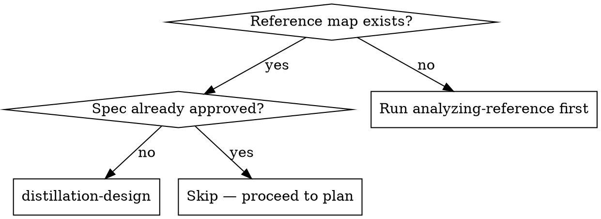

# Distillation Design

Interactive design step. The brainstorming analog, specialized for porting.

Read the reference map. Ask the user clarifying questions one at a time. Decide per-chunk modes. Produce a distillation spec the plan skill can consume — and that the user has signed off on.

**Announce at start:** "I'm using `distillation-design` to design the distillation."

<HARD-GATE>
Do NOT invoke `distillation-plan`, `distillation-execution`, or any port-side skill until the user has explicitly approved the written distillation spec. This applies to EVERY distillation regardless of perceived simplicity.
</HARD-GATE>

## Anti-Pattern: "This Is Too Simple To Need A Spec"

Every distillation goes through this process. A one-file copy, a single utility, a snippet you "just want to bring in" — all of them. "Simple" ports are where unexamined assumptions create hidden coupling and untraceable code. The spec can be short (one paragraph per section for truly simple ports), but you MUST produce it and get approval.

## When to Use



## Inputs

- A reference map at `docs/distilling/<repo>-<feature-slug>-reference-map.md` (produced by `analyzing-reference`).
- The user's project (for understanding target conventions: language, test framework, naming).

If the reference map is missing or stale, invoke `analyzing-reference` first.

## Output

A distillation spec at `docs/specs/YYYY-MM-DD-distill-<repo>-<feature-slug>.md` in the user's project, committed to git, **approved by the user**.

## Checklist

You MUST create a `TaskCreate` entry for each of these items and complete them in order:

1. **Read the reference map end-to-end.** Note surprises: large dep graph, heavy hidden coupling.
2. **Ask clarifying questions** (see below) one at a time, multiple-choice when possible.
3. **Assign a mode per chunk.** Use `references/mode-decision-criteria.md`. Record the criterion that triggered each decision.
4. **Define the target API.** How does the distilled feature look from inside the user's project?
5. **Define the equivalence test plan.** Which tests we port, adapt, write fresh, or fall back to spot-check.
6. **Write the distillation spec** to `docs/specs/YYYY-MM-DD-distill-<repo>-<feature-slug>.md`.
7. **Spec self-review** — see below.
8. **Commit the spec** with message: `spec: distill <repo>/<feature>`.
9. **User review gate.** Ask the user to review and approve. Wait. If changes requested, fix and re-review.
10. **Hand off to `distillation-plan`.**

## Clarifying Questions (one at a time)

Ask in this order. Prefer multiple-choice. Skip a question if the reference map already answers it unambiguously — but state the assumption out loud so the user can correct.

1. **Target API shape:** mirror the reference / wrap with our conventions / re-shape the interface entirely.
2. **Scope:** take everything in the reference map / take a subset (which chunks?). Mark `can-stub` deps as in-scope only if needed by the chosen subset.
3. **Target language:** same as reference / different (specify). If different, surface that this is a cross-language port and load `references/cross-language-notes.md`.
4. **Test strategy:** port reference tests / fresh equivalence tests captured from running the reference / spot-check only (forced if no tests exist or learn-then-rewrite mode dominates).
5. **External library substitutions:** for each external library in the reference map, ask: same library available in target / use an equivalent (which?) / replace with bespoke code.
6. **Hidden-coupling handling:** for each item in the reference map's hidden coupling section, ask: preserve / replace with target-project equivalent / explicitly remove from scope.

**One question per message.** If a topic needs more exploration, break it into multiple questions.

## Mode Assignment

For each chunk (typically one file, or one logical group of files), assign one mode:

- **copy** — same language, idiomatic for target. Bring the code over with minimal changes (rename imports/types to match target).
- **port** — different language, OR same language but materially different idioms (callback-style → async/await), OR same language but the chunk uses target-incompatible patterns (browser globals in a Node project).
- **learn-then-rewrite** — the chunk is heavily entangled with reference-specific infrastructure (DI containers, framework lifecycles, event buses) that don't exist in the target; OR the value is in the algorithmic *approach* rather than the code; OR cross-language translation is so heavy that "porting" is misleading.

See `references/mode-decision-criteria.md` for explicit criteria, including the **conflicting-signals rule**: prefer the more conservative mode (copy > port > learn-then-rewrite if you're torn).

**Record the chosen mode AND the deciding criterion for every chunk.** The plan skill needs both. The reviewer skills need both. "Just trust me" is not a criterion.

## Cross-Language Adaptations

When target language differs from source, load `references/cross-language-notes.md` and use it to:

- Map type systems (TS structural types ↔ Python `typing.Protocol`, Go interfaces, Rust traits).
- Map idioms (Promises ↔ async/await ↔ futures ↔ goroutines+channels).
- Identify library equivalents (axios ↔ requests, lodash ↔ stdlib).

Record the chosen translations per chunk in the spec's adaptation-notes column.

## Spec Structure

Write the spec to `docs/specs/YYYY-MM-DD-distill-<repo>-<feature-slug>.md`. Every spec MUST start with this header:

```markdown
# Distillation Spec: <repo>/<feature>

**Status:** Draft → awaiting user review.
**Date:** YYYY-MM-DD
**Reference map:** docs/distilling/<repo>-<feature-slug>-reference-map.md
**Reference path:** <REF_PATH — copied verbatim from the reference map>
**Reference commit:** <SHA>
**Source language:** <lang>  →  **Target language:** <lang>

---

> **Source paths in this spec are relative to `Reference path`.** Resolve them with `<REF_PATH>/<source-path>` when reading the file.

Then the eight standard sections:

```markdown
## 1. Goal
One paragraph: what feature, what value it brings to the user's project.

## 2. Scope
What we take, what we leave. Reference each chunk by source path.

## 3. Mode assignments

| Source chunk | Target file(s) | Mode | Deciding criterion | Adaptation notes |
| ------------ | -------------- | ---- | ------------------ | ---------------- |
| ...          | ...            | copy / port / learn-then-rewrite | ... | ... |

## 4. Target API
The public surface of the distilled feature inside the user's project.
Signatures, types, examples.

## 5. External library plan

| Reference library | Target choice | Notes |
| ----------------- | ------------- | ----- |

## 6. Hidden coupling resolutions

| Coupling item from ref map | Resolution |
| -------------------------- | ---------- |

## 7. Equivalence test plan
Test framework in target. For each chunk: port-reference-test / fresh-equivalence-tests / property-based / spot-check.
Fallbacks explicitly stated for chunks without reference tests.

## 8. Out of scope
Things explicitly NOT being distilled in this run, even if present in the reference map.

## 9. Success criteria
- All ported tests pass against the distilled code.
- Hidden coupling items each have a resolution; none left unaddressed.
```

## Spec Self-Review

After writing the spec, scan with fresh eyes:

1. **Placeholder scan:** any TBD / TODO / vague entries? Fix inline.
2. **Internal consistency:** does Section 3's mode column match Section 7's test plan? (A chunk marked `learn-then-rewrite` shouldn't say "port reference tests" without a note explaining why.)
3. **Scope coverage:** every chunk in the reference map is either in Section 3 (in scope) or Section 8 (out of scope). Nothing is silently dropped.
4. **Hidden coupling:** every item from the reference map is resolved in Section 6.

Fix issues inline. No re-review loop.

## User Review Gate

After self-review, write to the user:

> "Distillation spec written and committed to `<path>`. Please review it and approve before we move to writing the plan."

Wait. If changes requested, edit, re-run self-review, re-commit, ask again. Only proceed to `distillation-plan` after **explicit approval**.

## Common Rationalizations

| Excuse | Reality |
|--------|---------|
| "Just one file, no spec needed" | Tests need a spec row. Short ≠ skipped. |
| "I'll pick modes during execution" | The implementer subagent reads the spec row. No row = no port. |
| "User already approved verbally, skip the file" | The spec is the artifact. The plan reads it. Future you reads it. Write it. |
| "Cross-language is fine, I'll figure it out" | Load `cross-language-notes.md`. Idiom mismatches are where ports break. |

## Red Flags - STOP

- Mode column has rows without a deciding criterion.
- Section 8 ("Out of scope") is empty AND Section 3 doesn't cover every chunk from the map.
- Hidden coupling section is empty when the reference map listed items.
- About to proceed to `distillation-plan` without explicit user approval.

## What you do NOT do

- You do **not** map files to tasks. That's `distillation-plan`.
- You do **not** write code or tests. That's `distillation-execution`.

## Key Principles

- **One question at a time.** Don't overwhelm.
- **Multiple choice preferred.** Easier to answer than open-ended.
- **YAGNI ruthlessly.** Don't expand scope beyond what the user asked for.
- **Explicit modes.** Every chunk has a mode AND a criterion.
- **Approval before plan.** Hard gate. No exceptions.
