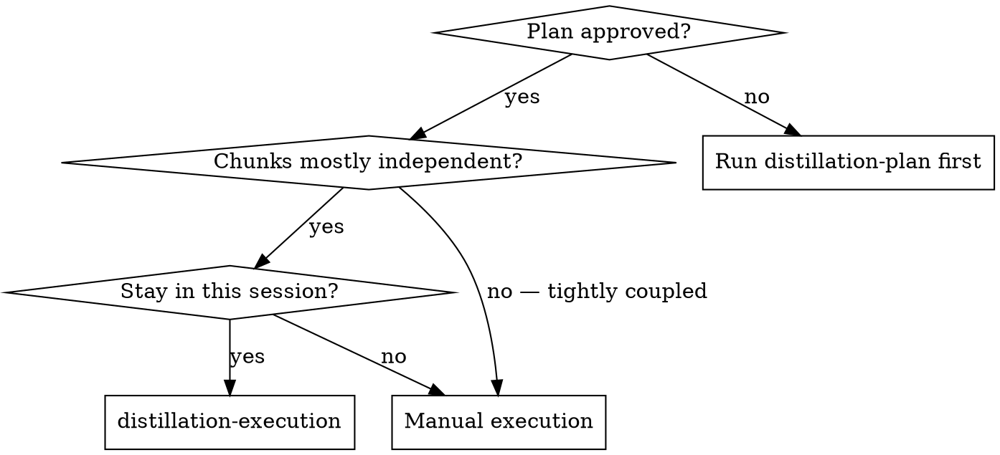
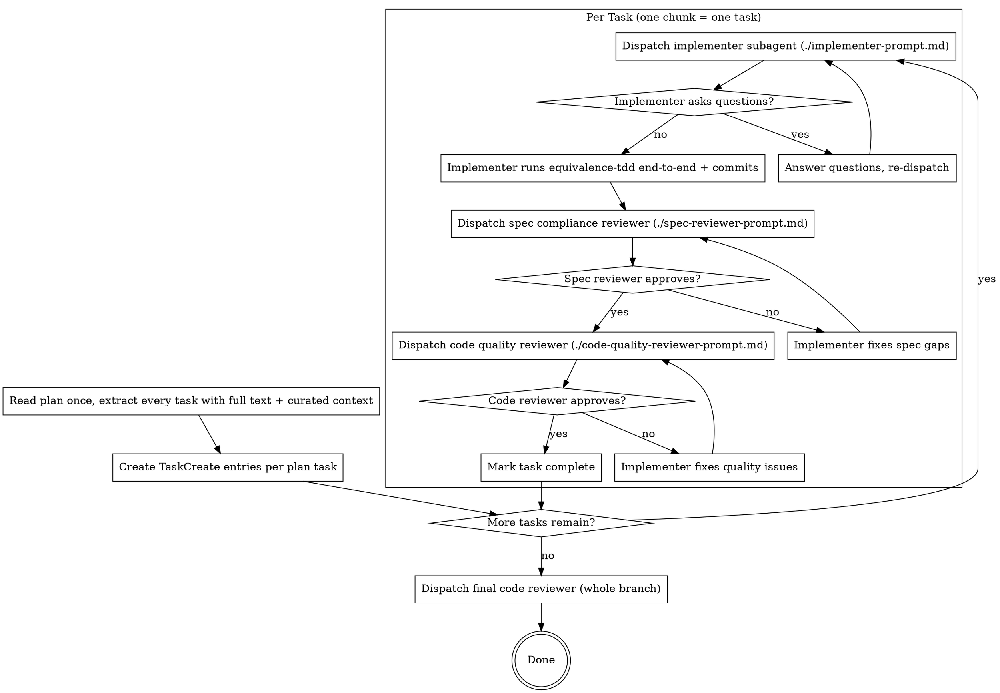

# Distillation Execution

Execute the distillation plan by dispatching a fresh implementer subagent per chunk, with tightly-scoped context. The implementer follows `code-distilling:equivalence-tdd` end-to-end inside its single dispatch — porting the test, running it failing, porting the implementation, running it passing, and committing. Run two-stage review after each chunk: **spec compliance first, then code quality**.

**Why subagents:** delegating chunks to specialized subagents with isolated context keeps them focused. You curate exactly what context they need; they should not inherit your session history. This preserves your context for coordination and review work.

**Core principle:** Fresh subagent per chunk + two-stage review (spec then quality) = high-quality ports, fast iteration.

**Continuous execution:** Do not pause to check in with your human partner between tasks. Execute every task from the plan without stopping. The only reasons to stop: BLOCKED status you cannot resolve, ambiguity that genuinely prevents progress, or all tasks complete. "Should I continue?" prompts and progress summaries waste time — they asked you to execute the plan, so execute it.

**Announce at start:** "I'm using `distillation-execution` to execute the plan with subagent-driven dispatch."

## When to Use



## Branch Safety

**Never start execution on `main` / `master` without explicit user consent.** If the current branch is the project's main branch, ask the user to confirm or to switch to a feature branch (e.g., `distill/<repo>-<feature-slug>`) first. **No exceptions.**

## The Process



## Steps

1. **Read the plan once.** Note the plan header's `Reference path` — this is `<REF_PATH>` for the rest of execution. Extract every task with its full text and required context: source paths to read (resolved against `<REF_PATH>`), target paths, mode, adaptation notes from the spec, the test source (path or captured cases).
2. **Create `TaskCreate` entries** — one per plan task.
3. **For each task in order:**
   a. Dispatch the implementer subagent using `implementer-prompt.md`. Provide the task text, the curated context, and a hard requirement to follow `code-distilling:equivalence-tdd` end-to-end within this single dispatch.
   b. If the implementer asks questions, answer clearly and completely before letting them proceed.
   c. After the implementer commits, dispatch the spec compliance reviewer using `spec-reviewer-prompt.md`. Re-dispatch the implementer with the reviewer's findings until the reviewer approves.
   d. Dispatch the code quality reviewer using `code-quality-reviewer-prompt.md`. Re-dispatch the implementer with the reviewer's findings until the reviewer approves.
   e. Mark the task complete.
4. **After all tasks:** dispatch the final code reviewer for the entire distillation diff against the branch base.
5. **Announce completion** with a summary: chunks distilled, modes used, tests passing.

## Curated Subagent Context

Implementer subagents should receive, per task:

- The full task text from the plan (**verbatim** — they do not read the plan file).
- The spec's row for this chunk (modes table + adaptation notes).
- The reference-map excerpt naming the file's transitive deps and hidden coupling.
- The exact source file content (read by you from `<REF_PATH>/<source-path>` and pasted into the prompt — for copy/port; **omit for learn-then-rewrite** to enforce independence). The subagent does not access the reference repo itself.
- The exact test command to run and what success/failure looks like.

Do **not** dump the entire spec, plan, or reference map. Curate.

## Model Selection

Use the least powerful model that can handle each role to conserve cost and increase speed.

| Task | Suggested model |
|------|-----------------|
| copy chunk, ≤2 files, no library substitution | cheap |
| port chunk, same language, no library substitution | cheap or standard |
| port chunk, cross-language or with substitution | standard |
| learn-then-rewrite | most capable |
| spec compliance reviewer | standard |
| code quality reviewer | standard or most capable |
| final code reviewer (whole diff) | most capable |

**Task complexity signals:**

- Touches 1–2 files with a complete spec row → cheap model.
- Multiple files, cross-language, or library substitution → standard.
- learn-then-rewrite, reviewer, or final review → most capable.

## Handling Implementer Status

Implementer subagents return one of four statuses. Handle each appropriately.

**DONE** — proceed to spec compliance review.

**DONE_WITH_CONCERNS** — read the concerns before proceeding.
- Concerns about correctness or scope → address before review.
- Observations ("this file is getting large") → note and proceed to review.

**NEEDS_CONTEXT** — the implementer needs information that wasn't provided. Provide it and re-dispatch.

**BLOCKED** — the implementer cannot complete the task. Diagnose:
1. Context problem → provide more context, re-dispatch same model.
2. Reasoning required → re-dispatch with more capable model.
3. Task too large → break into smaller tasks (amend the plan first).
4. Plan is wrong → escalate to the user.

**Never** ignore an escalation. **Never** force the same model to retry without changing something.

## Prompt Templates

- `./implementer-prompt.md` — dispatch implementer subagent
- `./spec-reviewer-prompt.md` — dispatch spec compliance reviewer subagent
- `./code-quality-reviewer-prompt.md` — dispatch code quality reviewer subagent

## Red Flags - BANNED

**Never:**

- Start execution on `main` / `master` without explicit user consent.
- Skip either review stage (spec compliance OR code quality).
- Proceed with unfixed issues from either reviewer.
- Dispatch multiple implementer subagents in parallel (conflicts on shared files).
- Make the subagent read the plan file (provide curated full text instead).
- Skip the scene-setting context for a task (subagent needs to know where it fits).
- Ignore subagent questions before they implement.
- Accept "close enough" on spec compliance.
- **Start code quality review before spec compliance is approved** (wrong order).
- Move to the next task while either review has open issues.
- Let the implementer pull lines from the reference for a `learn-then-rewrite` chunk.
- Split a chunk into separate test and implementation tasks — `equivalence-tdd` runs inside the implementer's single dispatch.

**If the subagent asks questions:** answer clearly and completely. Don't rush them.

**If a reviewer finds issues:** the same implementer subagent fixes them. The reviewer reviews again. Repeat until approved. Don't skip the re-review.

**If a subagent fails the task:** dispatch a fresh implementer with specific instructions. Don't try to fix manually (context pollution).

## Example Workflow

```
You: I'm using distillation-execution to execute the plan with subagent-driven dispatch.

[Read plan once: docs/plans/2026-05-26-distill-awesome-auth-oauth.md]
[Extract 5 chunks → 5 tasks]
[Create TaskCreate with all tasks]

Task 1: Port src/cache/lru.ts (mode: copy)
[Dispatch implementer with task text + curated context + pasted source]
Implementer:
  - Ported test/cache/lru.test.ts; ran it; FAIL: "Cannot find module 'src/cache/lru'"
  - Ported src/cache/lru.ts; ran the test; PASS
  - Committed abc1234 (test + impl in a single commit per equivalence-tdd)
  - DONE

[Dispatch spec compliance reviewer]
Spec reviewer: APPROVED — adaptation notes followed, mode adherence intact.

[Dispatch code quality reviewer]
Code reviewer: ISSUES (Important) — magic number 1024 should be a constant.

[Re-dispatch implementer with the issue]
Implementer: Extracted DEFAULT_CAPACITY. Commit def5678.

[Re-dispatch code reviewer]
Code reviewer: APPROVED.

[Mark Task 1 complete]

Task 2: Rewrite src/auth/strategy.ts (mode: learn-then-rewrite)
[Dispatch implementer with task text + ref-map excerpt + spec adaptation notes; NO source paste]
Implementer:
  - Wrote fresh equivalence tests from spec §7 captured cases
  - Ran tests; all FAIL on missing module
  - Wrote an independent implementation satisfying the tests
  - Ran tests; PASS
  - Committed ghi9012
  - DONE

[Dispatch spec compliance reviewer]
Spec reviewer: APPROVED — no reference-source phrasing detected.

[Dispatch code quality reviewer]
Code reviewer: APPROVED.

[Mark Task 2 complete]

... [Tasks 3 through 5 similarly] ...

[After all tasks]
[Dispatch final code reviewer for whole branch diff]
Final reviewer: APPROVED.

Done!
```

## Completion

Execution is done when:

- Every plan task is complete and both reviewers approved it.
- The final code reviewer has approved the whole diff.
- A short summary has been posted to the user with: chunks distilled, modes used, tests passing, any concerns to follow up on.

## Required Sub-Skills

- `code-distilling:equivalence-tdd` — every implementer subagent follows this end-to-end within its single dispatch.

## Upstream

- `code-distilling:analyzing-reference` → `code-distilling:distillation-design` → `code-distilling:distillation-plan` produce the artifacts this skill consumes (reference map, spec, plan).

## Key Principles

- **Fresh subagent per chunk.** No context pollution between tasks.
- **One task per chunk.** The implementer runs `equivalence-tdd` end-to-end (port test → fail → port impl → pass → single commit) inside the single dispatch — no `.t`/`.i` split at the controller level.
- **Two-stage review, in order.** Spec compliance gates code quality.
- **Continuous execution.** No "should I continue?" prompts.
- **Curate context.** Don't dump the plan; quote what's needed.
- **Cheapest model that works.** Reviewers and learn-then-rewrite get the most capable.
