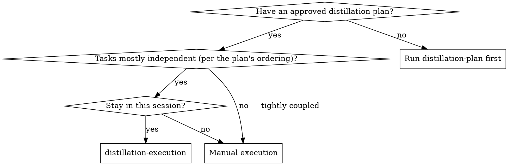
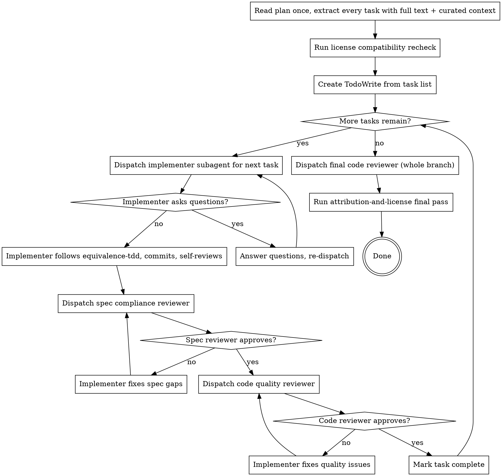

# Distillation Execution

Execute the distillation plan. Dispatch a fresh implementer subagent per task, with a tightly-scoped context. Run two-stage review after each task: spec compliance first, then code quality. Finish with the `attribution-and-license` final pass.

**Why subagents:** delegating to specialized subagents with isolated context keeps them focused. You curate exactly what context they need; they should not inherit your session history. This preserves your context for coordination and review.

**Continuous execution:** do not pause between tasks. Execute every task from the plan without stopping. Stop only on BLOCKED, ambiguity that genuinely prevents progress, or all tasks complete.

**Announce at start:** "I'm using `distillation-execution` to execute the plan with subagent-driven dispatch."

## When to use

## Branch safety

**Never start execution on `main` / `master` without explicit user consent.** If the current branch is the project's main branch, ask the user to confirm or to switch to a feature branch (e.g., `distill/<repo>-<feature-slug>`) first.

## Process

## Steps

1. **Read the plan once.** Extract every task with its full text and required context: source paths to read inside `ref-code/`, target paths, mode, adaptation notes from the spec, the test source (path or captured cases).
2. **License recheck.** Confirm the spec's compatibility result is still valid (target license hasn't changed; reference commit hash matches). If anything drifted, halt and escalate.
3. **Create `TaskCreate` entries** — one per plan task (test tasks and impl tasks both).
4. **For each task in order:**
   a. Dispatch the implementer subagent using `implementer-prompt.md`. Provide the task text, the curated context, and a hard requirement to follow `equivalence-tdd`.
   b. If the implementer asks questions, answer clearly and completely before letting them proceed.
   c. After the implementer commits, dispatch the spec compliance reviewer using `spec-reviewer-prompt.md`. Re-dispatch the implementer with the reviewer's findings until the reviewer approves.
   d. Dispatch the code quality reviewer using `code-quality-reviewer-prompt.md`. Re-dispatch the implementer with the reviewer's findings until the reviewer approves.
   e. Mark the task complete.
5. **After all tasks:** dispatch the final code reviewer for the entire distillation diff against the branch base.
6. **Run the `attribution-and-license` final pass.** This generates/updates `ATTRIBUTION.md`, copies source licenses to `licenses/`, verifies every distilled file has a header, and verifies every commit has a `Source:` or `Source-influence:` trailer.
7. **Announce completion** with a summary: chunks distilled, modes used, tests passing, attribution status.

## Curated subagent context

Implementer subagents should receive, per task:

- The full task text from the plan (verbatim — they should not read the plan file).
- The spec's row for this chunk (modes table + adaptation notes).
- The reference-map excerpt naming the file's transitive deps and hidden coupling.
- The exact source file content from `ref-code/<repo>/<path>` (for copy/port; omit for learn-then-rewrite to enforce independence).
- The attribution header template filled with values (so they paste, not invent).
- The exact test command to run and what success/failure looks like.

Do **not** dump the entire spec, plan, or reference map. Curate.

## Model selection

Use the least powerful model that can handle each role.

- **Mechanical tasks** (a single-file copy with mechanical renames): cheap model.
- **Port tasks** (translation, integration concerns): standard model.
- **Learn-then-rewrite tasks, all reviewers, final review**: most capable model.

Indicators:

| Task | Suggested model |
|------|-----------------|
| copy chunk, ≤2 files, no library substitution | cheap |
| port chunk, same language, no library substitution | cheap or standard |
| port chunk, cross-language or with substitution | standard |
| learn-then-rewrite | most capable |
| spec compliance reviewer | standard |
| code quality reviewer | standard or most capable |
| final code reviewer (whole diff) | most capable |

## Handling implementer status

Implementer subagents return one of four statuses:

- **DONE** — proceed to spec compliance review.
- **DONE_WITH_CONCERNS** — read the concerns. If correctness or scope, address before review. If observations, note and proceed.
- **NEEDS_CONTEXT** — provide missing context and re-dispatch.
- **BLOCKED** — diagnose:
  1. Context problem → provide more, re-dispatch same model.
  2. Reasoning required → re-dispatch with more capable model.
  3. Task too large → break into smaller tasks (amend plan first).
  4. Plan is wrong → escalate to user.

Never ignore an escalation. Never force the same model to retry without changing something.

## Red flags (banned)

- Starting execution on `main` without explicit user consent.
- Skipping either review stage (spec compliance OR code quality).
- Proceeding with unfixed issues from either reviewer.
- Dispatching multiple implementer subagents in parallel (conflicts on shared files).
- Making the subagent read the plan file (curate full text instead).
- Skipping the scene-setting context for a task.
- Ignoring subagent questions before they implement.
- Accepting "close enough" on spec compliance.
- Starting code quality review before spec compliance is approved.
- Moving to the next task while either review has open issues.
- Skipping the final `attribution-and-license` pass.
- Letting the implementer pull lines from the reference for a `learn-then-rewrite` chunk.

## Required sub-skills

- `code-distilling:equivalence-tdd` — every implementer follows this.
- `code-distilling:attribution-and-license` — invoked at start (recheck) and end (final pass).

## Prompt templates

- `./implementer-prompt.md`
- `./spec-reviewer-prompt.md`
- `./code-quality-reviewer-prompt.md`

## Completion

Execution is done when:

- Every plan task is complete and both reviewers approved it.
- The final code reviewer has approved the whole diff.
- The `attribution-and-license` final pass committed.
- A short summary has been posted to the user with: chunks distilled, modes used, tests passing, attribution status, any concerns to follow up on.
