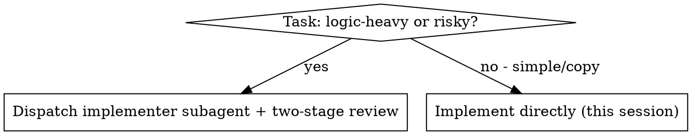
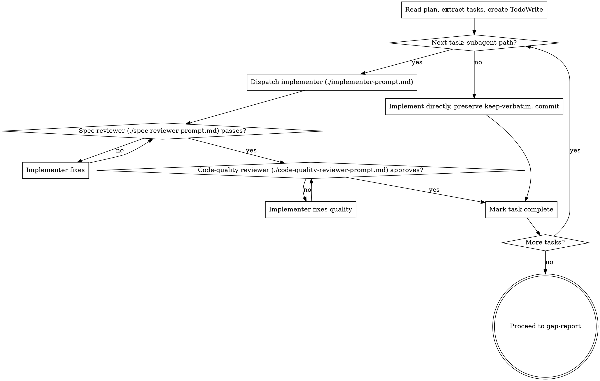

# Distillation Implementation (Stage 4)

Execute the distillation plan, task by task. Each task carries its mode, its keep-verbatim items, and its seam substitutions — bring the reference's encoded decisions into your project under that mode, preserving the keep-verbatim items and wiring the seams to your dependencies.

**Continuous execution:** Do not pause to check in with the user between tasks. The human gates are between stages, not between tasks. Execute the whole plan, then proceed to `gap-report`. Stop only for a BLOCKED you cannot resolve, genuine ambiguity, or completion.

## When to Use Subagents vs Implement Directly

Decide per task:

- **Logic-heavy or risky tasks** (algorithms, `learn-then-rewrite`, multi-file, the keep-verbatim gold): dispatch a fresh implementer subagent, then two-stage review — spec-compliance first, then code-quality.
- **Simple tasks** (`copy` mode, a single small file, no substitutions): implement directly — the review overhead isn't worth it. Still preserve keep-verbatim and commit per task.

## The Process

1. Read the plan once. Extract all tasks with their full text. Create a TodoWrite task per task.
2. For each task, by its mode and complexity, take the subagent path or the direct path.
3. On the subagent path: dispatch the implementer with the task's full text — which carries its mode, keep-verbatim items, and seam substitutions — pasted in (don't make the subagent read the plan file). On DONE, run the spec-compliance reviewer; on pass, the code-quality reviewer. Loop fixes until both pass.
4. Mark the task complete. Continue until the plan is done.
5. Proceed to `gap-report` — verification comes before declaring the port done. (Do NOT jump to finishing the branch.)

## Distillation-Aware Review

The two reviewers check the usual things PLUS the distillation-specific ones — which is why the prompts here are not the generic ones:

- **Keep-verbatim preserved** — every code-as-data item present and byte-for-byte unaltered (no rounded constants, no rephrased prompts, no reordered steps).
- **No leaked deps** — the port does not import the reference's framework/libraries; seams wired to your project's deps per the plan.
- **Mode discipline** — a `learn-then-rewrite` task contains no pasted reference lines; a `copy` task changed nothing but imports/naming.

## Model Selection

Use the least powerful model that can handle each role.

- Mechanical task (`copy`, 1–2 files, complete plan steps) → fast, cheap model.
- Integration/port task (multi-file, idiom translation) → standard model.
- `learn-then-rewrite` or design-judgment task, and all review roles → most capable model.

## Handling Implementer Status

- **DONE:** proceed to spec-compliance review.
- **DONE_WITH_CONCERNS:** read the concerns first; address correctness/scope concerns before review, note observations and proceed.
- **NEEDS_CONTEXT:** provide the missing context and re-dispatch.
- **BLOCKED:** assess — more context, a more capable model, a smaller task, or escalate to the user if the plan itself is wrong. Never force the same model to retry unchanged. If a `port` task turned into a rewrite, escalate to re-classify the mode (a spec/plan amendment) — don't shift modes silently.

## Prompt Templates

- `./implementer-prompt.md` — dispatch implementer subagent
- `./spec-reviewer-prompt.md` — dispatch spec-compliance reviewer
- `./code-quality-reviewer-prompt.md` — dispatch code-quality reviewer
