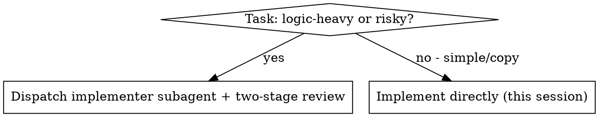
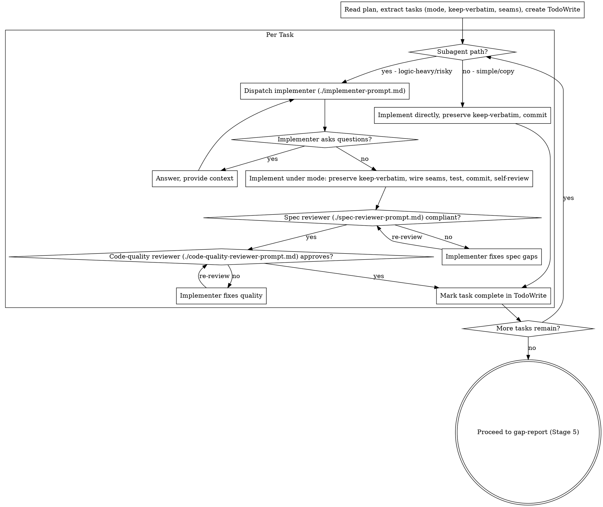

# Distillation Implementation (Stage 4)

Execute the distillation plan, task by task. Each task carries its mode, its keep-verbatim items, and its seam substitutions — bring the reference's encoded decisions into your project under that mode, preserving the keep-verbatim items and wiring the seams to your dependencies.

**Why subagents:** You delegate logic-heavy chunks to fresh agents with isolated context. By crafting their instructions precisely — the task's mode, its keep-verbatim items, its seam substitutions — you keep them focused and stop the reference's packaging from leaking into your project. They never inherit your session's history; you hand them exactly the chunk they need. This also preserves your own context for coordination work.

**Core principle:** Fresh subagent per logic-heavy chunk + two-stage distillation-aware review (spec compliance then code quality) = faithful port, fast iteration. Simple copies go direct.

**Continuous execution:** Do not pause to check in with the user between tasks. The human gates are between stages, not between tasks. Execute the whole plan, then proceed to `gap-report`. Stop only for a BLOCKED you cannot resolve, genuine ambiguity, or completion.

## When to Use

You're in Stage 4: the distillation plan is approved. Execute it. Two decisions drive each task — whether it takes the subagent path or the direct path, and (on the subagent path) what mode it runs under.



- **Logic-heavy or risky tasks** (algorithms, `learn-then-rewrite`, multi-file, the keep-verbatim gold): dispatch a fresh implementer subagent, then two-stage review — spec-compliance first, then code-quality.
- **Simple tasks** (`copy` mode, a single small file, no substitutions): implement directly — the review overhead isn't worth it. Still preserve keep-verbatim and commit per task.

**vs. plain subagent-driven-development:**
- Every task carries a mode (`copy` / `port` / `learn-then-rewrite`), keep-verbatim items, and seam substitutions
- Reviews check distillation discipline too: keep-verbatim preserved, no leaked deps, mode honored
- Ends by proceeding to `gap-report` (Stage 5) — a fidelity audit before the port is declared done, not straight to finishing the branch

## The Process



1. Read the plan once. Extract all tasks with their full text — each carries its mode, keep-verbatim items, and seam substitutions. Create a TodoWrite task per task.
2. For each task, by its mode and complexity, take the subagent path (logic-heavy/risky) or the direct path (simple/copy).
3. **Subagent path:** dispatch the implementer with the task's full text pasted in (don't make the subagent read the plan file). Answer any questions before it proceeds. On DONE, run the spec-compliance reviewer; on pass, the code-quality reviewer. Loop fixes until both pass.
4. **Direct path:** implement it yourself, preserve every keep-verbatim item, commit.
5. Mark the task complete. Continue until the plan is done.
6. Proceed to `gap-report` — verification comes before declaring the port done. (Do NOT jump to finishing the branch.)

## Distillation-Aware Review

The two reviewers check the usual things PLUS the distillation-specific ones — which is why the prompts here are not the generic ones:

- **Keep-verbatim preserved** — every code-as-data item present and byte-for-byte unaltered (no rounded constants, no rephrased prompts, no reordered steps).
- **No leaked deps** — the port does not import the reference's framework/libraries; seams wired to your project's deps per the plan.
- **Mode discipline** — a `learn-then-rewrite` task contains no pasted reference lines; a `copy` task changed nothing but imports/naming.

## Model Selection

Use the least powerful model that can handle each role.

- Mechanical task (`copy`, 1–2 files, complete plan steps) → fast, cheap model.
- Integration/port task (multi-file, idiom translation) → standard model.
- `learn-then-rewrite` or design-judgment task, and all review roles → most capable model.

**Task complexity signals:**
- `copy` mode, 1–2 files, complete spec → cheap model
- `port` mode, multiple files, idiom/structure translation → standard model
- `learn-then-rewrite`, design judgment, or broad reference understanding → most capable model

## Handling Implementer Status

Implementer subagents report one of four statuses. Handle each appropriately:

**DONE:** Proceed to spec-compliance review.

**DONE_WITH_CONCERNS:** The implementer completed the work but flagged doubts. Read the concerns first. If they're about correctness or scope, address them before review. If they're observations (e.g., "this file is getting large"), note them and proceed to review.

**NEEDS_CONTEXT:** The implementer needs information that wasn't provided — a missing keep-verbatim value, an unclear seam, the reference location. Provide it and re-dispatch.

**BLOCKED:** The implementer cannot complete the task. Assess the blocker:
1. If it's a context problem, provide more context and re-dispatch with the same model.
2. If the task needs more reasoning, re-dispatch with a more capable model.
3. If the task is too large, break it into smaller chunks.
4. If a `port` task turned into a rewrite, escalate to re-classify the mode (a spec/plan amendment) — don't shift modes silently.
5. If the plan itself is wrong, escalate to the user.

**Never** ignore an escalation or force the same model to retry unchanged. If the implementer said it's stuck, something needs to change.

## Prompt Templates

- `./implementer-prompt.md` — dispatch implementer subagent
- `./spec-reviewer-prompt.md` — dispatch spec-compliance reviewer
- `./code-quality-reviewer-prompt.md` — dispatch code-quality reviewer

## Example Workflow

```
You: Executing the distillation plan (Stage 4): docs/code-distilling/token-bucket/distillation-plan.md

[Read plan once]
[Extract all 4 tasks with full text — each with mode, keep-verbatim, seams]
[Create TodoWrite with all tasks]

Task 1: Core refill algorithm  (mode: learn-then-rewrite)
  keep-verbatim: REFILL_INTERVAL_MS = 250, BURST_FACTOR = 1.5
  seams: their now() -> our clock.monotonic()

[Logic-heavy -> subagent path]
[Dispatch implementer with full task text + mode + keep-verbatim + seams pasted in]

Implementer: "Does the reference clamp to MAX_TOKENS before or after refill?"
You: "After refill — see reference bucket.go:42."
Implementer: [proceeds]
  - Wrote an independent token bucket (no pasted reference lines)
  - Preserved REFILL_INTERVAL_MS=250 and BURST_FACTOR=1.5 exactly, cited bucket.go
  - Wired the clock seam to clock.monotonic(); imported none of their runtime
  - 7/7 tests passing; committed: distill(ratelimit): token-bucket refill
  - Self-review: all good

[Dispatch spec-compliance reviewer]
Spec reviewer: ❌ Issues:
  - Altered keep-verbatim: BURST_FACTOR rounded to 1 at bucket.ts:19 (spec says 1.5)
  - Leaked dep: imports the reference's pkg/log at bucket.ts:3

[Implementer fixes: restores 1.5, drops the log import]
Spec reviewer: ✅ Compliant — keep-verbatim exact, no leaked deps, mode honored (independent rewrite)

[Get git SHAs, dispatch code-quality reviewer]
Code reviewer: Strengths: idiomatic TS, constants isolated and labeled. Issues: none. Approved.

[Mark Task 1 complete]

Task 2: Config struct  (mode: copy, 1 file)

[Simple/copy -> direct path]
[Implement directly, preserve field names + defaults, commit: distill(ratelimit): config]
[Mark Task 2 complete]

...

[After all tasks]
Proceed to gap-report (Stage 5) — do NOT finish the branch yet.

Done with Stage 4!
```

## Advantages

**vs. porting by hand in this session:**
- Fresh context per chunk — the reference's framing can't bleed from one chunk into the next
- The subagent gets exactly the mode, keep-verbatim items, and seams it needs (no more, no less)
- The subagent can ask before guessing — about the contract, a keep-verbatim value, or a seam

**vs. plain subagent-driven-development:**
- Reviews enforce fidelity (keep-verbatim) and cleanliness (no leaked deps), not just spec + quality
- Modes make the keep / translate / rewrite decision explicit per chunk
- Routes to `gap-report` for a fidelity audit before the branch is finished

**Efficiency gains:**
- No file-reading overhead — you provide the full task text, mode, keep-verbatim, and seams
- You curate exactly the context each chunk needs
- The subagent gets complete information upfront
- Questions surface before work begins, not after

**Quality gates:**
- Self-review catches issues before handoff
- Two-stage review: spec compliance (incl. keep-verbatim, no leaked deps, mode) then code quality (incl. target idioms, no leaked cruft)
- Review loops ensure fixes actually land
- `gap-report` audits completeness and fidelity at the end

**Cost:**
- More subagent invocations (implementer + 2 reviewers per logic-heavy chunk)
- You do more prep work (extracting all tasks, modes, keep-verbatim, and seams upfront)
- Review loops add iterations
- But catches altered constants, leaked deps, and mode drift early — far cheaper than discovering them in `gap-report` or after merge

## Red Flags

**Never:**
- Start implementation on main/master without explicit user consent
- Skip a review (spec compliance OR code quality)
- Proceed with unfixed issues
- Dispatch multiple implementer subagents in parallel (conflicts)
- Make a subagent read the plan file (paste the full task text instead)
- Skip the mode / keep-verbatim / seam context (the subagent needs to know where the chunk fits)
- **Alter keep-verbatim** — round a constant, reword a prompt, reorder steps. It's the gold; reproduce it exactly, citing the reference location.
- **Import the reference's deps** — wire seams to your project's dependencies per the plan instead.
- **Silently shift a mode** — if a `port` turned into a rewrite, escalate to re-classify it (a spec/plan amendment).
- Paste reference lines into a `learn-then-rewrite` chunk (that makes it a port)
- Accept "close enough" on spec compliance (spec reviewer found issues = not done)
- **Start code quality review before spec compliance is ✅** (wrong order)
- Move to the next task while either review has open issues
- **Jump to finishing the branch** — `gap-report` (Stage 5) comes first

**If a subagent asks questions:**
- Answer clearly and completely
- Provide the missing context (a keep-verbatim value, the reference location, a seam mapping)
- Don't rush them into implementation

**If a reviewer finds issues:**
- The same implementer subagent fixes them
- The reviewer reviews again
- Repeat until approved — don't skip the re-review

**If a subagent fails the task:**
- Dispatch a fix subagent with specific instructions, or re-dispatch per the BLOCKED guidance above
- Don't try to fix it manually (context pollution)

## Integration

**Within the code-distilling flow:**
- **code-distilling:distillation-plan** — produces the plan this stage executes
- **code-distilling:gap-report** — Stage 5 verification; run it after all tasks (NOT finishing-a-development-branch directly)
- **code-distilling:equivalence-testing** — optional; reference-derived tests for chunks with clear I/O
- **code-distilling:using-code-distilling** — the overall 5-stage flow and its human gates

**Subagents use:**
- The prompt templates in this skill — `./implementer-prompt.md`, `./spec-reviewer-prompt.md`, `./code-quality-reviewer-prompt.md`. They are self-contained: this plugin does not ship `requesting-code-review`.

**Workspace:**
- Work on a dedicated branch, not main. If the superpowers plugin is available, **superpowers:using-git-worktrees** gives an isolated workspace.
