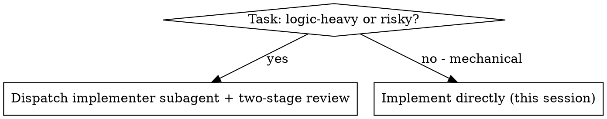
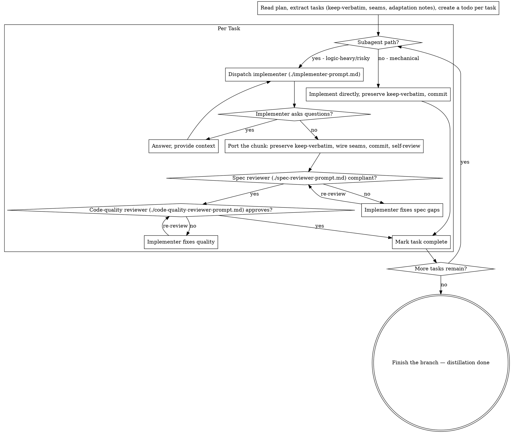

# Distillation Implementation (Stage 3)

Execute the distillation plan, task by task. Every task is a port: bring the reference's encoded decisions into your project — preserving the keep-verbatim items exactly, following the task's adaptation notes, and wiring the seams to your dependencies.

**Why subagents:** You delegate logic-heavy chunks to fresh agents with isolated context. By crafting their instructions precisely — the task's keep-verbatim items, its seam substitutions, its adaptation notes — you keep them focused and stop the reference's packaging from leaking into your project. They never inherit your session's history; you hand them exactly the chunk they need. This also preserves your own context for coordination work.

**Core principle:** Fresh subagent per logic-heavy chunk + two-stage distillation-aware review (spec compliance then code quality) = faithful port, fast iteration. Mechanical chunks go direct.

**Continuous execution:** Do not pause to check in with the user between tasks. The human gates are between stages, not between tasks. Execute the whole plan, then finish the branch. Stop only for a BLOCKED you cannot resolve, genuine ambiguity, or completion.

## When to Use

You're in Stage 3: the distillation plan is approved. Execute it. One decision drives each task — whether it takes the subagent path or the direct path.


```dot
digraph when {
    "Task: logic-heavy or risky?" [shape=diamond];
    "Dispatch implementer subagent + two-stage review" [shape=box];
    "Implement directly (this session)" [shape=box];

    "Task: logic-heavy or risky?" -> "Dispatch implementer subagent + two-stage review" [label="yes"];
    "Task: logic-heavy or risky?" -> "Implement directly (this session)" [label="no - mechanical"];
}
```

- **Logic-heavy or risky tasks** (algorithms, the keep-verbatim gold, non-trivial adaptation, multi-file, any seam carrying a semantic delta): dispatch a fresh implementer subagent, then two-stage review — spec-compliance first, then code-quality.
- **Mechanical tasks** (a single small file, a direct translation, no substitutions): implement directly — the review overhead isn't worth it. Still preserve keep-verbatim and commit per task.

**vs. plain subagent-driven-development:**

- Every task carries keep-verbatim items, seam substitutions, and adaptation notes — the keep / translate decision is explicit per item, not per chunk
- Reviews enforce distillation discipline too: keep-verbatim preserved, no leaked deps, adaptation notes followed

## The Process


```dot
digraph process {
    rankdir=TB;

    "Read plan, extract tasks (keep-verbatim, seams, adaptation notes), create a todo per task" [shape=box];

    subgraph cluster_per_task {
        label="Per Task";
        "Subagent path?" [shape=diamond];
        "Dispatch implementer (./implementer-prompt.md)" [shape=box];
        "Implementer asks questions?" [shape=diamond];
        "Answer, provide context" [shape=box];
        "Port the chunk: preserve keep-verbatim, wire seams, commit, self-review" [shape=box];
        "Implement directly, preserve keep-verbatim, commit" [shape=box];
        "Spec reviewer (./spec-reviewer-prompt.md) compliant?" [shape=diamond];
        "Implementer fixes spec gaps" [shape=box];
        "Code-quality reviewer (./code-quality-reviewer-prompt.md) approves?" [shape=diamond];
        "Implementer fixes quality" [shape=box];
        "Mark task complete" [shape=box];
    }

    "More tasks remain?" [shape=diamond];
    "Finish the branch — distillation done" [shape=doublecircle];

    "Read plan, extract tasks (keep-verbatim, seams, adaptation notes), create a todo per task" -> "Subagent path?";
    "Subagent path?" -> "Dispatch implementer (./implementer-prompt.md)" [label="yes - logic-heavy/risky"];
    "Subagent path?" -> "Implement directly, preserve keep-verbatim, commit" [label="no - mechanical"];
    "Dispatch implementer (./implementer-prompt.md)" -> "Implementer asks questions?";
    "Implementer asks questions?" -> "Answer, provide context" [label="yes"];
    "Answer, provide context" -> "Dispatch implementer (./implementer-prompt.md)";
    "Implementer asks questions?" -> "Port the chunk: preserve keep-verbatim, wire seams, commit, self-review" [label="no"];
    "Port the chunk: preserve keep-verbatim, wire seams, commit, self-review" -> "Spec reviewer (./spec-reviewer-prompt.md) compliant?";
    "Spec reviewer (./spec-reviewer-prompt.md) compliant?" -> "Implementer fixes spec gaps" [label="no"];
    "Implementer fixes spec gaps" -> "Spec reviewer (./spec-reviewer-prompt.md) compliant?" [label="re-review"];
    "Spec reviewer (./spec-reviewer-prompt.md) compliant?" -> "Code-quality reviewer (./code-quality-reviewer-prompt.md) approves?" [label="yes"];
    "Code-quality reviewer (./code-quality-reviewer-prompt.md) approves?" -> "Implementer fixes quality" [label="no"];
    "Implementer fixes quality" -> "Code-quality reviewer (./code-quality-reviewer-prompt.md) approves?" [label="re-review"];
    "Code-quality reviewer (./code-quality-reviewer-prompt.md) approves?" -> "Mark task complete" [label="yes"];
    "Implement directly, preserve keep-verbatim, commit" -> "Mark task complete";
    "Mark task complete" -> "More tasks remain?";
    "More tasks remain?" -> "Subagent path?" [label="yes"];
    "More tasks remain?" -> "Finish the branch — distillation done" [label="no"];
}
```

1. Read the plan once. Extract all tasks with their full text — each carries its keep-verbatim items, seam substitutions, and adaptation notes. Create a todo per task.
2. For each task, by its complexity and risk, take the subagent path (logic-heavy/risky) or the direct path (mechanical).
3. **Subagent path:** dispatch the implementer with the task's full text pasted in (don't make the subagent read the plan file). Answer any questions before it proceeds. On DONE, run the spec-compliance reviewer; on pass, the code-quality reviewer. Loop fixes until both pass.
4. **Direct path:** implement it yourself, preserve every keep-verbatim item, commit.
5. Mark the task complete. Continue until the plan is done.
6. When the plan is complete, finish the branch — the port is done.

## Distillation-Aware Review

The two reviewers check the usual things PLUS the distillation-specific ones — which is why the prompts here are not the generic ones:

- **Keep-verbatim preserved** — every code-as-data item present and byte-for-byte unaltered (no rounded constants, no rephrased prompts, no reordered steps).
- **No leaked deps** — the port does not import the reference's framework/libraries; seams wired to your project's deps per the plan.
- **Adaptation honored** — the task's adaptation notes were followed: structure the spec called load-bearing is preserved, and the scaffolding the spec discarded did not come along for the ride.

## Model Selection

Use the least powerful model that can handle each role.

- 1–2 files, mechanical translation, complete plan steps → fast, cheap model.
- Multiple files, idiom/structure translation, a library substitution → standard model.
- Heavy adaptation, design judgment, broad reference understanding — and all review roles → most capable model.

## Handling Implementer Status

Implementer subagents report one of four statuses. Handle each appropriately:

**DONE:** Proceed to spec-compliance review.

**DONE_WITH_CONCERNS:** The implementer completed the work but flagged doubts. Read the concerns first. If they're about correctness or scope, address them before review. If they're observations (e.g., "this file is getting large"), note them and proceed to review.

**NEEDS_CONTEXT:** The implementer needs information that wasn't provided — a missing keep-verbatim value, an unclear seam, the reference location. Provide it and re-dispatch.

**BLOCKED:** The implementer cannot complete the task. Assess the blocker:
1. If it's a context problem, provide more context and re-dispatch with the same model.
2. If the task needs more reasoning, re-dispatch with a more capable model.
3. If the task is too large, break it into smaller chunks.
4. If the chunk can't be ported without discarding the reference's structure wholesale, escalate — the chunk was mis-scoped, or its packaging belongs on the discard list (a spec/plan amendment). Don't let it quietly become an original implementation.
5. If the plan itself is wrong, escalate to the user.

**Never** ignore an escalation or force the same model to retry unchanged. If the implementer said it's stuck, something needs to change.

## Prompt Templates

- `./implementer-prompt.md` — dispatch an implementer subagent
- `./spec-reviewer-prompt.md` — dispatch the spec-compliance reviewer
- `./code-quality-reviewer-prompt.md` — dispatch the code-quality reviewer

The templates are self-contained and distillation-aware — use them, not generic review prompts. This plugin does not ship `requesting-code-review`.

## Example Workflow

```
You: Executing the distillation plan (Stage 3): docs/code-distilling/token-bucket/distillation-plan.md

[Read plan once]
[Extract all 4 tasks with full text — each with keep-verbatim, seams, adaptation notes]
[Create a todo per task]

Task 1: Core refill algorithm
  keep-verbatim: REFILL_INTERVAL_MS = 250, BURST_FACTOR = 1.5
  seams: their now() -> our clock.monotonic()  (delta: none — clock.monotonic() verified monotonic)
  adaptation: their goroutine-per-bucket refill -> a lazy refill computed on read;
              the refill *formula* and clamp order are load-bearing, the goroutine is not

[Logic-heavy -> subagent path]
[Dispatch implementer with full task text + keep-verbatim + seams + adaptation notes pasted in]

Implementer: "Does the reference clamp to MAX_TOKENS before or after refill?"
You: "After refill — see reference bucket.go:42."
Implementer: [proceeds]
  - Ported the refill formula and clamp order; dropped the goroutine per the adaptation note
  - Preserved REFILL_INTERVAL_MS=250 and BURST_FACTOR=1.5 exactly
  - Wired the clock seam to clock.monotonic(); imported none of their runtime
  - Spot-checked the refill math against the reference; committed: feat(ratelimit): token-bucket refill
  - Self-review: all good

[Dispatch spec-compliance reviewer]
Spec reviewer: ❌ Issues:
  - Altered keep-verbatim: BURST_FACTOR rounded to 1 at bucket.ts:19 (spec says 1.5)
  - Leaked dep: imports the reference's pkg/log at bucket.ts:3

[Implementer fixes: restores 1.5, drops the log import]
Spec reviewer: ✅ Compliant — keep-verbatim exact, no leaked deps, adaptation honored (clamp order preserved, goroutine correctly dropped)

[Get git SHAs, dispatch code-quality reviewer]
Code reviewer: Strengths: idiomatic TS, constants isolated and labeled. Issues: none. Approved.

[Mark Task 1 complete]

Task 2: Config struct  (1 file, mechanical)

[Mechanical -> direct path]
[Implement directly, preserve field names + defaults, commit: feat(ratelimit): config]
[Mark Task 2 complete]

...

[After all tasks]
Finish the branch — the port is done.

Done with Stage 3!
```

## Trade-offs

The subagent path costs more: three dispatches per logic-heavy task (implementer + two reviewers), plus the prep of extracting every task's full context upfront. It pays for itself — altered constants, leaked deps, and dropped adaptations are caught per task, far cheaper than discovering them after merge. And because each subagent gets complete information before starting, questions surface before work begins, not after.

## Red Flags

**Never:**
- Start implementation on main/master without explicit user consent
- Skip a review (spec compliance OR code quality)
- Proceed with unfixed issues
- Dispatch multiple implementer subagents in parallel (conflicts)
- Make a subagent read the plan file (paste the full task text instead)
- Skip the keep-verbatim / seam / adaptation context (the subagent needs to know where the chunk fits)
- **Alter keep-verbatim** — round a constant, reword a prompt, reorder steps. It's the gold; reproduce it exactly.
- **Name the reference in the code** — no repo name, file path, line number, or "port of / adapted from" in comments, docstrings, or identifiers. Provenance lives in the distillation spec; the shipped code reads as this project's own.
- **Import the reference's deps** — wire seams to your project's dependencies per the plan instead.
- **Silently reinvent a chunk** — if you can't port it without discarding the reference's structure wholesale, escalate; the chunk was mis-scoped (a spec/plan amendment).
- **Drop an adaptation note** — the note says which structure is load-bearing; ignoring it loses an encoded decision as surely as rounding a constant.
- Accept "close enough" on spec compliance (spec reviewer found issues = not done)
- **Start code quality review before spec compliance is ✅** (wrong order)
- Move to the next task while either review has open issues

**If a subagent asks questions:**
- Answer clearly and completely
- Provide the missing context (a keep-verbatim value, the reference location, a seam mapping)
- Don't rush them into implementation

**If a reviewer finds issues:**
- The same implementer subagent fixes them
- The reviewer reviews again
- Repeat until approved — don't skip the re-review

**If a subagent fails the task:**
- Dispatch a fix subagent with specific instructions, or re-dispatch per the BLOCKED guidance above
- Don't try to fix it manually (context pollution)
