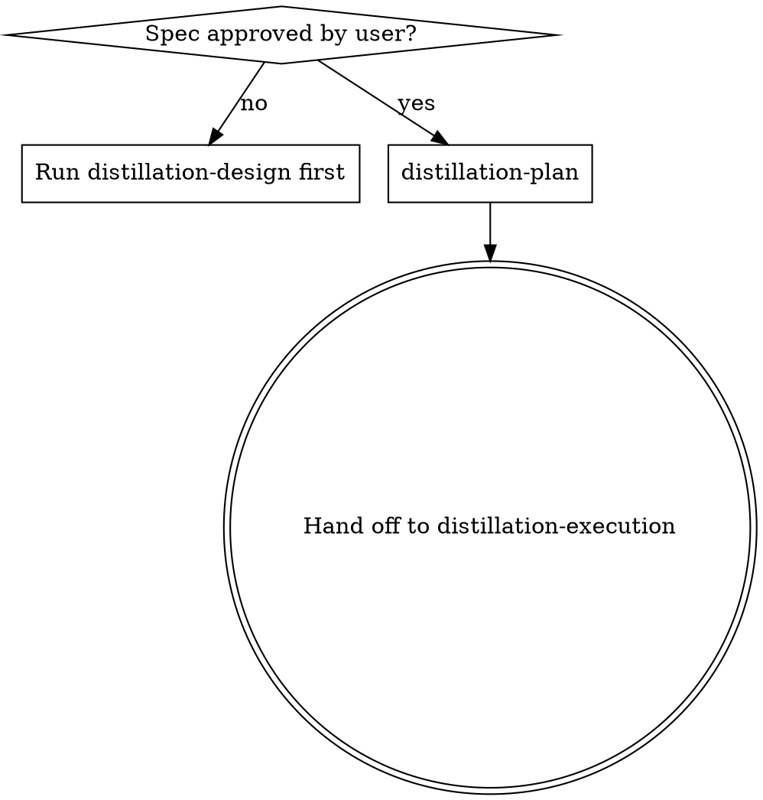

# Distillation Plan

## Overview

Translate the distillation spec into a task-by-task plan ready for execution. Assume the implementer (or the implementer subagent) knows the target stack but has zero context for the reference repo and questionable taste. Document everything they need: which source path, which target path, which mode, which adaptations, which test to port, what command to run, what passes look like, exact commit message.

**Announce at start:** "I'm using `distillation-plan` to write the implementation plan."

**Save plans to:** `docs/plans/YYYY-MM-DD-distill-<repo>-<feature-slug>.md`

## When to Use



## Inputs

- An approved distillation spec at `docs/specs/YYYY-MM-DD-distill-<repo>-<feature-slug>.md`.
- The reference map the spec was derived from.

If the spec is missing or unapproved, invoke `distillation-design` first.

## Scope Check

If the spec covers multiple independent features that should have been split during design, suggest splitting now — one plan per feature. Each plan should produce a working, testable distillation on its own.

## Bite-Sized Task Granularity

**Each step is one action (2-5 minutes):**

- "Port the test file" — step
- "Run the test against the not-yet-ported target" — step
- "Confirm failure is for the right reason" — step
- "Add attribution header" — step
- "Port the implementation" — step
- "Run the test" — step
- "Commit" — step

If a task has more than ~7 steps, split it.

## Plan Document Header

Every plan MUST start with this header:

```markdown
# Distillation Plan: <repo>/<feature>

> **For agentic workers:** REQUIRED SUB-SKILLS: Use `code-distilling:distillation-execution` to execute this plan task-by-task. The execution skill dispatches subagents that follow `code-distilling:equivalence-tdd` for every implementation task. Steps use checkbox (`- [ ]`) syntax.

**Spec:** `docs/specs/YYYY-MM-DD-distill-<repo>-<feature-slug>.md`
**Reference map:** `docs/distilling/<repo>-<feature-slug>-reference-map.md`
**Reference commit:** <SHA>
**Source language → Target language:** <lang> → <lang>

---
```

## Source → Target File Map

Before defining tasks, write the file map. One row per target file.

```markdown
## Source → Target File Map

| # | Source path(s) | Target path | Mode | Test source | Adaptation notes |
|---|----------------|-------------|------|-------------|------------------|
| 1 | ref-code/<repo>/src/util/lru.ts | src/cache/lru.ts | copy | ref-code/<repo>/test/util/lru.test.ts → test/cache/lru.test.ts | rename `LRU` to `LruCache` per target conventions |
| 2 | ref-code/<repo>/src/auth/oauth.ts | src/auth/oauth.ts | port | ref-code/<repo>/test/auth/oauth.test.ts → test/auth/oauth.test.ts | callback-style → async/await; swap `axios` for `fetch` |
| 3 | (design influence) ref-code/<repo>/src/auth/strategy.ts | src/auth/strategy.ts | learn-then-rewrite | fresh-equivalence-tests captured in spec §7 | independent implementation |
```

For `learn-then-rewrite` rows, the source column names the reference module that inspired the design, prefixed with `(design influence)`.

## Task Order

Order tasks by dependency. A utility chunk distills before chunks that import it. If the chunk graph has cycles, break them by introducing a target-only seam — record this in the spec's adaptation notes.

## Task Structure

Tasks come in pairs (test → implementation) per chunk, followed by a brief attribution verification step. Each task is 2–5 minutes of focused work.

### Task N.t: Port test for <chunk>

````markdown
**Files:**
- Create: `test/path/to/chunk.test.<ext>`
- Read: `ref-code/<repo>/test/path/to/chunk.test.<ext>` (or "behavior captures in spec §7" for fresh-equivalence-tests)

**Mode:** copy / port / learn-then-rewrite (the test-side translation; may differ from the impl mode)

- [ ] **Step 1: Port / translate the test file**

```<lang>
<paste the actual ported/translated test code here — no placeholders>
```

- [ ] **Step 2: Run the test against the not-yet-ported target**

Run: `<target test command, e.g. pnpm test test/path/chunk.test.ts>`
Expected: FAIL with `Cannot find module 'src/path/chunk'` or similar import-error pattern.

- [ ] **Step 3: Confirm failure is for the right reason**

If the test passes accidentally or fails for an unrelated reason, stop and fix the test before moving to the implementation task.
````

### Task N.i: Port implementation for <chunk>

````markdown
**Files:**
- Create or modify: `src/path/to/chunk.<ext>`
- Read: `ref-code/<repo>/src/path/to/chunk.<ext>` (or omit for learn-then-rewrite)
- Test: `test/path/to/chunk.test.<ext>` (from Task N.t)

**Mode:** copy / port / learn-then-rewrite

**Adaptation notes from spec:** <quote the relevant row verbatim>

- [ ] **Step 1: Add the attribution header**

```<comment style>
<paste the actual header here, with values filled in from the reference map>
```

- [ ] **Step 2: Port / translate / rewrite the implementation**

```<lang>
<paste the implementation here — full code, no placeholders>
```

(For `learn-then-rewrite`: do NOT paste the reference code. Instead, paste a guidance note: "Write a target-idiomatic implementation that satisfies the test in N.t. Reference is design influence only; do not consult its source lines while implementing.")

- [ ] **Step 3: Run the test**

Run: `<target test command>`
Expected: PASS.

- [ ] **Step 4: Commit**

```bash
git add test/path/to/chunk.test.<ext> src/path/to/chunk.<ext>
git commit -m "distill(<repo>): <chunk summary>

Source: <repo>@<short-sha>:<source path>
License: <SPDX>"
```

(For learn-then-rewrite, use `Source-influence:` instead of `Source:`.)
````

## Final Task

```markdown
### Task F: Finalize attribution

**Sub-skill:** `attribution-and-license` — final pass.

- [ ] Verify every distilled file has a header (grep across the distillation branch).
- [ ] Generate or update `ATTRIBUTION.md` with a section for `<repo>` listing every distilled file.
- [ ] Copy the source LICENSE to `licenses/<repo>-<spdx>.txt` if not already present.
- [ ] Verify every distillation commit has a `Source:` or `Source-influence:` trailer.
- [ ] Commit: `chore(attribution): finalize attribution for <repo> distillation`.
```

## No Placeholders

Every step must contain the actual content an implementer needs. These are **plan failures** — never write them:

- "TBD", "TODO", "implement later", "fill in details".
- "Add appropriate error handling" / "handle edge cases" without showing how.
- "Port the test" without including the actual ported test code.
- "Similar to Task N" — repeat the code; the implementer may read tasks out of order.
- Steps that describe **what** to do without showing **how** (code blocks required where code is involved).
- Source paths that don't exist in `ref-code/<repo>/`.
- Target paths that don't follow the user's project conventions (check the project's existing layout).
- Attribution headers with `<TODO>` fields — fill them from the reference map.

## Self-Review

After writing the complete plan, look at the spec with fresh eyes and check the plan against it:

1. **Spec coverage:** every chunk from the spec's mode-assignments table is in the file map and has a task pair. Anything from Section 9 ("Out of scope") of the spec is NOT in the plan.
2. **Path consistency:** every source path exists in `ref-code/<repo>/`. Every target path is one a reasonable implementer would create.
3. **Mode consistency:** the mode column in the file map matches what each task's prompts ask the implementer to do (copy code shown vs. design-influence note).
4. **Test source consistency:** if the spec says `port-reference-test` for a chunk, the test task references a real test file in `ref-code/`. If `fresh-equivalence-tests`, the test task pastes the cases from the spec.
5. **Attribution coverage:** every implementation task has a Step-1 attribution header. The Final Task is present.
6. **Dependency order:** for each chunk, every chunk it imports is earlier in the task list.

Fix issues inline. If a chunk is missing a task pair, add it. If the spec has been over- or under-implemented, escalate to the user before continuing.

## Common Rationalizations

| Excuse | Reality |
|--------|---------|
| "Implementer can read the source file, I don't need to paste it" | Implementer subagents get isolated context. They can't see what isn't in the task. |
| "Tests can come after, let me sketch impl tasks first" | Pair test ↔ impl per chunk. `equivalence-tdd` needs the test before the impl. |
| "I'll skip the file map, the tasks have paths" | The map is the audit trail. Reviewers and the user read it before any task. |
| "Attribution header in the final task is enough" | Headers go in the same commit as the code. Per-task, not deferred. |

## Red Flags - STOP

- A task says "see Task N" instead of repeating code.
- A task has steps but no code blocks where code is needed.
- A chunk has an implementation task but no test task (or vice versa).
- The file map is missing rows for chunks that have tasks.
- The Final Task is missing.

## Commit and Hand Off

After self-review, commit the plan:

```bash
git add docs/plans/YYYY-MM-DD-distill-<repo>-<feature-slug>.md
git commit -m "plan: distill <repo>/<feature>"
```

Announce:

> "Plan written and committed to `<path>`. Ready for execution. Invoking `distillation-execution`."

## What you do NOT do

- You do **not** write the actual ported code into the target tree. That's execution.
- You do **not** re-decide modes; modes come from the approved spec.
- You do **not** modify `ref-code/`.
- You do **not** start execution from this skill — `distillation-execution` is the next step.

## Key Principles

- **Exact file paths always.**
- **Complete code in every step** — if a step changes code, show the code.
- **Exact commands with expected output.**
- **DRY, YAGNI, TDD, frequent commits.**
- **Pair test ↔ impl per chunk.**
- **One final attribution task.**
