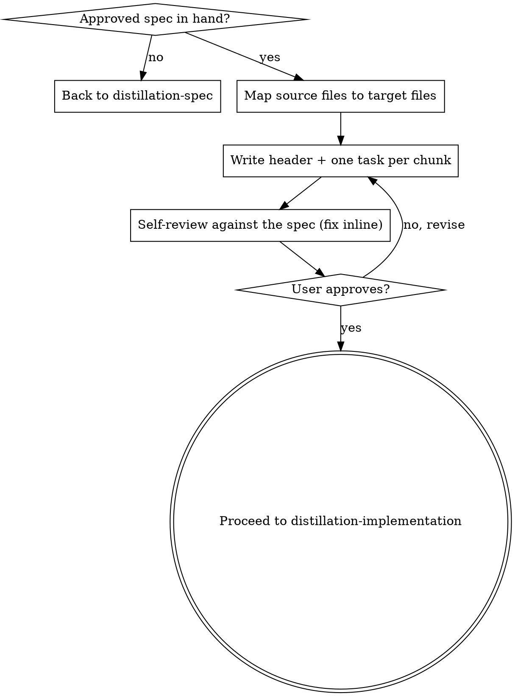

# Distillation Plan (Stage 2)

Turn the approved distillation spec into an implementation plan a zero-context engineer can execute. Document everything: the source (reference) → target file map, which files each task touches, the exact code, the keep-verbatim items to reproduce, the seam substitutions to make, and when to commit. Bite-sized tasks.

Assume the implementer is a skilled developer who knows almost nothing about this project, the reference, or what's worth preserving. Everything they need to keep the gold and avoid leaking the reference's deps must be in the plan.

<HARD-GATE>
Do NOT dispatch implementers or write any port code until the plan is written and the user has approved it. This applies to EVERY port regardless of how small it looks.
</HARD-GATE>

## When to Use

You're in Stage 2: the user has approved the distillation spec — the contract, the keep-verbatim list, the discard list, the seam→your-deps mapping, and the chunk table. Every task in the plan traces back to a chunk in the spec. If the spec is missing or unapproved, go back to `distillation-spec` first.

If the spec covers multiple independent capabilities, it should have been split during the spec stage. If it wasn't, suggest splitting into separate plans — one per capability. Each plan should produce working code on its own.

## Checklist

You MUST create a todo for each of these items and complete them in order:

1. **Confirm the input** — the approved spec is in hand; one capability per plan
2. **Map source → target files** — lock in the decomposition before defining tasks
3. **Write the plan header** — goal, reference @ commit, target, approach
4. **Write one task per chunk** — complete code carrying the chunk's keep-verbatim items, seam substitutions with their delta resolutions, and adaptation notes
5. **Self-review against the spec** — fix issues inline
6. **Write distillation-plan.md and get user gate approval**

## The Process


```dot
digraph distillation_plan {
    "Approved spec in hand?" [shape=diamond];
    "Back to distillation-spec" [shape=box];
    "Map source files to target files" [shape=box];
    "Write header + one task per chunk" [shape=box];
    "Self-review against the spec (fix inline)" [shape=box];
    "User approves?" [shape=diamond];
    "Proceed to distillation-implementation" [shape=doublecircle];

    "Approved spec in hand?" -> "Back to distillation-spec" [label="no"];
    "Approved spec in hand?" -> "Map source files to target files" [label="yes"];
    "Map source files to target files" -> "Write header + one task per chunk";
    "Write header + one task per chunk" -> "Self-review against the spec (fix inline)";
    "Self-review against the spec (fix inline)" -> "User approves?";
    "User approves?" -> "Write header + one task per chunk" [label="no, revise"];
    "User approves?" -> "Proceed to distillation-implementation" [label="yes"];
}
```

### Source → Target File Map

Before defining tasks, map the reference's files to your project's files. This locks in decomposition.

| Reference (source) | Your project (target) | Notes |
|--------------------|-----------------------|-------|
| `ref/path/foo.py` | `src/path/foo.ts` (create) | seam: their store → your store |

Each target file should have one clear responsibility; files that change together live together. Follow the project's existing patterns — don't unilaterally restructure.

## The Plan Document

Write to `docs/code-distilling/<capability>/distillation-plan.md`.

### Header

Every plan MUST start with this header:

```markdown
# [Capability] Distillation Plan

> **For agentic workers:** REQUIRED SUB-SKILL: Use code-distilling:distillation-implementation to execute this plan. It dispatches a fresh subagent per logic-heavy task (two-stage review) and implements simple tasks directly. Steps use checkbox (`- [ ]`) syntax.

**Goal:** [one sentence — what capability is being distilled into this project]

**Reference:** [repo @ commit] → **Target:** [where it lands]

**Approach:** [2–3 sentences — the main adaptations, the main seams]

---
```

### Task Structure

Each task carries its distillation context, then bite-sized steps. Each step is one action (2–5 minutes). Every task follows the same shape: implement preserving keep-verbatim and wiring seams, spot-check, commit.

````markdown
### Task N: [Chunk Name]

**Files:**
- Source: `ref/path/to/source.py` (reference @ <commit>)
- Create: `src/exact/path.ts`

**Adaptation notes (from the spec):** [what changes on the way over and why — idiom translation, which structure is load-bearing, library substitutions, scaffolding dropped]

**Keep-verbatim (reproduce EXACTLY — no rounding, rephrasing, reordering):**
- `THRESHOLD = 0.83` (ref source.py:42)
- [prompt template / step order / regex / lookup table …]

**Seam substitutions (carry each delta's resolution from the spec):**
- their `VectorStore` → this project's `src/db/store.ts` — delta: theirs pre-filters, ours post-filters → resolution: re-rank after fetch
- do NOT import the reference's framework/libraries

- [ ] **Step 1: Implement** — preserve keep-verbatim, wire seams

```ts
// complete code — for a port, keep-verbatim items appear verbatim here
```

- [ ] **Step 2: Spot-check / verify** — `<exact command>` — Expected: builds clean / pristine output

- [ ] **Step 3: Commit**

```bash
git add <files>
git commit -m "feat(<feature>): <what was implemented>"
```
````

## Red Flags: Placeholders

Every step must contain the actual content. These are plan failures — never write them:

- "TBD", "TODO", "implement later", "port the rest"
- "Add error handling" / "handle edge cases" without the code
- "Preserve their constants" without listing the actual values
- "Similar to Task N" (repeat the code — tasks may be read out of order)
- A keep-verbatim item named but not shown (the implementer can't preserve what isn't there)
- A seam the spec flagged with a delta, carried into the task without its resolution (the implementer can't compensate for a difference nobody told them about)
- References to types/functions not defined in any task

## Self-Review

After writing the plan, check it against the spec with fresh eyes (your own checklist, not a subagent dispatch):

1. **Chunk coverage:** does every chunk in the spec have a task? List gaps.
2. **Keep-verbatim coverage:** does every keep-verbatim item appear, verbatim, in some task? A constant in the spec but missing from the plan is a dropped trick.
3. **Placeholder scan:** any of the Red Flags above? Fix them.
4. **Seam/adaptation consistency:** does each task carry its chunk's adaptation notes from the spec? Are seam substitutions specified? Does every spec seam delta carry its resolution into the task that touches that seam? Does any task quietly import a reference dep?
5. **Type consistency:** do signatures/names used in later tasks match earlier ones?

Fix issues inline. For a large plan, optionally dispatch `./plan-document-reviewer-prompt.md` for an independent check.

## User Gate

> "Distillation plan written to `<path>`. Please review the task breakdown and the keep-verbatim items before we implement."

Wait for approval. On changes, update and re-run the self-review. Only proceed to `distillation-implementation` once the user approves.

## Key Principles

- **Exact file paths always** — both source (reference) and target
- **Complete code in every code step** — keep-verbatim items appear verbatim in the task
- **Exact commands with expected output**
- **Seam substitutions named per task** — no reference deps introduced
- **DRY, YAGNI, frequent commits**
