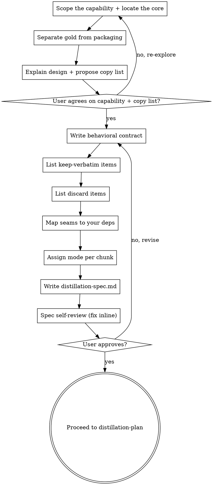

# Distillation Spec (Stage 1)

Explore the reference, converge with the user on exactly what's worth copying, and turn that into a spec the implementer can build from. The spec is the contract: it says exactly what to keep verbatim, what to discard, how the reference's edges wire into your project, and how each chunk gets ported. The Stage 3 implementer subagents — who never see this conversation — build from this doc alone.

A distillation spec is NOT a feature spec. It is anchored to the reference. Every chunk traces back to specific reference code, carries a mode, and names the encoded decisions it must preserve.

<HARD-GATE>
Do NOT decompose into tasks, dispatch implementer subagents, or write any port code until the spec is written and the user has approved the capability and the keep/discard split. This applies to EVERY port regardless of how small it looks.
</HARD-GATE>

## Anti-Pattern: "It's Obvious What To Copy"

Every distillation goes through this stage — a one-file utility, a single function, a snippet, all of them. The danger of "obvious" is that the *encoded decisions* — a threshold, the order of two steps, an edge-case branch — hide in plain sight, and code that looks like packaging is sometimes the gold. Skipping the spec is how distillations go wrong: without a written keep-verbatim list, a tuned constant gets "cleaned up"; without a discard list, the reference's framework leaks in; without a seam mapping, you ship a dependency on a directory outside your project. The spec can be a paragraph for a tiny port — but you MUST write it and get approval.

## Checklist

You MUST create a task for each of these items and complete them in order:

1. **Scope the capability** — name it in one sentence; locate the core path that delivers it
2. **Separate gold from packaging** — essential vs accidental; logic vs data
3. **Explain the design + converge on the copy list** — dialogue with the user, get agreement
4. **Write the behavioral contract** — inputs, outputs, invariants, what "correct" means
5. **List the keep-verbatim items** — the code-as-data gold
6. **List the discard items** — the accidental complexity left behind
7. **Map the seams to your deps** — the reference's inputs/outputs → your project's dependencies
8. **Assign a mode per chunk** — copy / port / learn-then-rewrite (see references)
9. **Write distillation-spec.md, self-review, and get user gate approval**

## Process Flow

## The Process

### Explore the reference first

Before writing a single line of the spec, understand what you're copying and agree with the user on it.

**Scoping the capability:**

- Name the target precisely — the specific behavior, not the whole project. "Retrieval with their re-ranking step," not "their whole library."
- A sharp name keeps you from dragging in the entire repo. If you can't say it in one sentence, you haven't scoped it yet.

**Finding the core:**

- Trace the one path that delivers the capability, from entry point to result.
- Deliberately ignore CLI, config systems, examples, telemetry, test scaffolding, backwards-compat shims. You want the lines that matter, not the thousands around them.
- Skip changelog and issue archaeology; too much effort for this stage.

**Separating gold from packaging:**

Two distinctions do the heavy lifting. Apply both to every piece of the core:

- **Essential vs accidental** — the algorithm and its tricks (essential) vs their framework, config, logging, abstractions-for-their-scale (accidental). Keep essential, drop accidental.
- **Logic vs data** — control flow and structure (logic; freely rewritten later in your idioms) vs constants, thresholds, prompt templates, the *order* of steps, specific regexes/normalizations (data; empirical findings, copied verbatim).

The classic mistake is backwards: faithfully reproducing their class hierarchy (packaging) while paraphrasing a tuned prompt or rounding off a `0.83` threshold (the gold). The code-as-data items you flag here become the keep-verbatim list below.

**Explaining and converging with the user:**

- Explain the reference's design in plain terms — the key moves and why they exist.
- Propose what to copy and what to leave. Ask, don't assume: the user knows their project's constraints and stack; you know the reference.
- Converge on the copy list before writing the spec. Be ready to go back and re-explore if something doesn't add up.

### Then write the spec

**Writing the behavioral contract:**

- State inputs → outputs precisely, plus the invariants that must hold.
- Define what "correct" means for this capability — the bar the port must meet.
- Keep it about observable behavior, not implementation.

**Listing keep-verbatim items (the gold):**

- Pull the code-as-data items you flagged during exploration: thresholds, constants, prompt templates, the order of steps, specific regexes/normalizations, lookup tables.
- These are empirical findings, not style. They are copied exactly — no rounding, no rephrasing, no reordering. Cite the reference location for each.

**Listing discard items:**

- Name the accidental complexity you are deliberately leaving behind: their framework, config system, logging, telemetry, backwards-compat shims, abstractions for their scale.
- Being explicit here is what keeps the port lean.

**Mapping seams to your deps:**

- For each input/output seam of the core, name the concrete substitution: their store → your store, their model client → your client, their data format → yours.
- Distinguish secret sauce (distill it) from commodity plumbing (use your stack's native lib). When your project already pins a library for the job, prefer the pin and record it.

**Assigning a mode per chunk:**

Break the capability into chunks. For each, assign a mode using `references/mode-decision-criteria.md`:

- **copy** — same language, matching idioms, no substitutions: bring it over near-verbatim.
- **port** — different language or idioms, or a library substitution: preserve structure, translate idiomatically.
- **learn-then-rewrite** — entangled with their infra, or the cross-language gap is too wide: understand it, then write independent code that satisfies the contract.

For cross-language ports, consult `references/cross-language-notes.md` and record per-chunk adaptation notes.

## After the Spec

**Documentation:**

Write to `docs/code-distilling/<capability>/distillation-spec.md`:

- **Capability** — one sentence, plus the core files/functions and the main path.
- **Their design** — the key moves and the *why* (from the code), in brief.
- **Contract** — inputs/outputs, invariants, definition of correct.
- **Keep-verbatim** — each item + its reference location.
- **Discard** — what's left behind.
- **Seam mapping** — the reference's edge → your dependency.
- **Chunk table** — chunk · reference location · mode · keep-verbatim items · adaptation notes.
- **Provenance** — yours ← theirs @ commit, for later re-sync.

**Spec Self-Review:**

Look at it with fresh eyes:

1. **Placeholder scan:** any TBD/TODO/vague chunk? Fix it.
2. **Consistency:** does the chunk table cover the whole contract? Does every keep-verbatim item appear in a chunk?
3. **Scope:** is this one capability, or does it need to split?
4. **Ambiguity:** could a chunk's mode or adaptation be read two ways? Make it explicit.

Fix issues inline. No need to re-review.

**User Review Gate:**

> "Distillation spec written to `<path>`. Please review — is this the right capability and core, is the keep/discard split right, and are the seam substitutions correct before we plan?"

Wait for approval. On changes, re-explore or update and re-run the self-review. Only proceed to `distillation-plan` once the user approves.

## Key Principles

- **Explore before you extract** — dialogue first, document second
- **Scope to a capability, not a repo** — name it in one sentence
- **Find the core, ignore the packaging** — the lines that matter, not the repo around them
- **Anchored to the reference** — every chunk traces to specific reference code
- **Keep data verbatim, rewrite logic freely** — the keep-verbatim list is sacred
- **Name what you discard** — explicit discard keeps the port lean
- **Seams are where your deps go** — distill secret sauce, use your own plumbing
- **It scales down** — a tiny port gets a few-sentence exploration and a one-paragraph spec with a two-row chunk table
