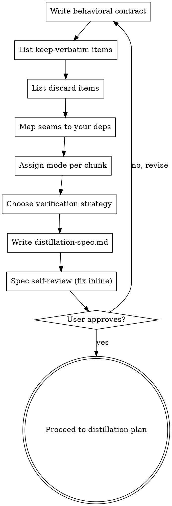

# Distillation Spec (Stage 2)

Turn the approved reference analysis into a spec the implementer can build from. The spec is the contract: it says exactly what to keep verbatim, what to discard, how the reference's edges wire into your project, and how each chunk gets ported. The Stage 3 implementer subagents — who never see this conversation — build from this doc alone.

A distillation spec is NOT a feature spec. It is anchored to the reference. Every chunk traces back to specific reference code, carries a mode, and names the encoded decisions it must preserve.

<HARD-GATE>
Do NOT decompose into tasks, dispatch implementer subagents, or write any port code until the spec is written and the user has approved the keep/discard split and the verification strategy. This applies to EVERY port regardless of how small it looks.
</HARD-GATE>

## Anti-Pattern: "I'll Just Start Porting"

Skipping the spec is how distillations go wrong. Without a written keep-verbatim list, a tuned constant gets "cleaned up." Without a discard list, the reference's framework leaks in. Without a seam mapping, you ship a dependency on a directory outside your project. The spec can be a paragraph for a tiny port — but you MUST write it and get approval.

## Checklist

You MUST create a task for each of these items and complete them in order:

1. **Write the behavioral contract** — inputs, outputs, invariants, what "correct" means
2. **List the keep-verbatim items** — the code-as-data gold from the analysis
3. **List the discard items** — the accidental complexity left behind
4. **Map the seams to your deps** — the reference's inputs/outputs → your project's dependencies
5. **Assign a mode per chunk** — copy / port / learn-then-rewrite (see references)
6. **Choose the verification strategy** — what gap-report should focus on
7. **Write distillation-spec.md, self-review, and get user gate approval**

## Process Flow

## The Process

**Writing the behavioral contract:**

- State inputs → outputs precisely, plus the invariants that must hold.
- Define what "correct" means for this capability — the bar `gap-report` will hold the port to.
- Keep it about observable behavior, not implementation.

**Listing keep-verbatim items (the gold):**

- Pull the code-as-data items the analysis flagged: thresholds, constants, prompt templates, the order of steps, specific regexes/normalizations, lookup tables.
- These are empirical findings, not style. They are copied exactly — no rounding, no rephrasing, no reordering. Cite the reference location for each.

**Listing discard items:**

- Name the accidental complexity you are deliberately leaving behind: their framework, config system, logging, telemetry, backwards-compat shims, abstractions for their scale.
- Being explicit here is what keeps the port lean.

**Mapping seams to your deps:**

- For each input/output seam from the analysis, name the concrete substitution: their store → your store, their model client → your client, their data format → yours.
- Distinguish secret sauce (distill it) from commodity plumbing (use your stack's native lib). When your project already pins a library for the job, prefer the pin and record it.

**Assigning a mode per chunk:**

Break the capability into chunks. For each, assign a mode using `references/mode-decision-criteria.md`:

- **copy** — same language, matching idioms, no substitutions: bring it over near-verbatim.
- **port** — different language or idioms, or a library substitution: preserve structure, translate idiomatically.
- **learn-then-rewrite** — entangled with their infra, or the cross-language gap is too wide: understand it, then write independent code that satisfies the contract.

For cross-language ports, consult `references/cross-language-notes.md` and record per-chunk adaptation notes.

**Choosing the verification strategy:**

- Reading-based comparison via `gap-report` is the verification — it always runs.
- Note what `gap-report` should focus on for this capability: the riskiest keep-verbatim items, the seams most likely to leak, the invariants hardest to eyeball.

## After the Spec

**Documentation:**

Write to `docs/code-distilling/<capability>/distillation-spec.md`:

- **Contract** — inputs/outputs, invariants, definition of correct.
- **Keep-verbatim** — each item + its reference location.
- **Discard** — what's left behind.
- **Seam mapping** — the reference's edge → your dependency.
- **Chunk table** — chunk · reference location · mode · keep-verbatim items · adaptation notes.
- **Verification strategy** — what gap-report should focus on.
- **Provenance** — yours ← theirs @ commit, for later re-sync.

**Spec Self-Review:**

Look at it with fresh eyes:

1. **Placeholder scan:** any TBD/TODO/vague chunk? Fix it.
2. **Consistency:** does the chunk table cover the whole contract? Does every keep-verbatim item appear in a chunk?
3. **Scope:** is this one capability, or does it need to split?
4. **Ambiguity:** could a chunk's mode or adaptation be read two ways? Make it explicit.

Fix issues inline. No need to re-review.

**User Review Gate:**

> "Distillation spec written to `<path>`. Please review — is the keep/discard split right, are the seam substitutions correct, and is the verification strategy realistic before we implement?"

Wait for approval. On changes, update and re-run the self-review. Only proceed to `distillation-plan` once the user approves.

## Key Principles

- **Anchored to the reference** — every chunk traces to specific reference code
- **Keep data verbatim, rewrite logic freely** — the keep-verbatim list is sacred
- **Name what you discard** — explicit discard keeps the port lean
- **Seams are where your deps go** — distill secret sauce, use your own plumbing
- **Verify by reading** — `gap-report` compares the port against the reference
- **It scales down** — a tiny port gets a one-paragraph spec with a two-row chunk table
