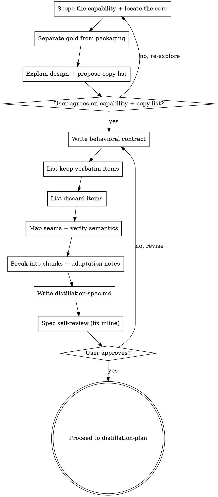

# Distillation Spec (Stage 1)

Explore the reference, converge with the user on exactly what's worth copying, and turn that into a spec the implementer can build from. The spec is the contract: it says exactly what to keep verbatim, what to discard, and how the reference's edges wire into your project. The Stage 3 implementer subagents — who never see this conversation — build from this doc alone.

A distillation spec is NOT a feature spec. It is anchored to the reference. Every chunk traces back to specific reference code and names the encoded decisions it must preserve.

**Every chunk is a port.** Preserve the reference's encoded decisions — the keep-verbatim items exactly, and its structure wherever the structure is load-bearing — and translate everything else into your project's language and idioms. There is no separate "just copy it" or "read it and rewrite from scratch": the keep-verbatim list already says precisely what must survive untouched, and the discard list already says what gets left behind. Those two lists carry the fidelity decision per item, which is finer-grained than any per-chunk label.

<HARD-GATE>
Do NOT decompose into tasks, dispatch implementer subagents, or write any port code until the spec is written and the user has approved the capability and the keep/discard split. This applies to EVERY port regardless of how small it looks.
</HARD-GATE>

## When to Use

You're in Stage 1: porting intent is present and the user has pointed you at a reference. Every distillation starts here — a one-file utility, a single function, a snippet, all of them.

The danger of "it's obvious what to copy" is that the *encoded decisions* — a threshold, the order of two steps, an edge-case branch — hide in plain sight, and code that looks like packaging is sometimes the gold. Skipping the spec is how distillations go wrong: without a written keep-verbatim list, a tuned constant gets "cleaned up"; without a discard list, the reference's framework leaks in; without a seam mapping, you ship a dependency on a directory outside your project. The spec can be a paragraph for a tiny port — but you MUST write it and get approval.

## Checklist

You MUST create a todo for each of these items and complete them in order:

1. **Scope the capability** — name it in one sentence; locate the core path that delivers it
2. **Separate gold from packaging** — essential vs accidental; logic vs data
3. **Explain the design + converge on the copy list** — dialogue with the user, get agreement
4. **Write the behavioral contract** — inputs, outputs, invariants, what "correct" means
5. **List the keep-verbatim items** — the code-as-data gold
6. **List the discard items** — the accidental complexity left behind
7. **Map and verify the seams** — the reference's inputs/outputs → your project's dependencies, each substitution's semantic delta checked against the target's actual code
8. **Break the capability into chunks** — each traced to reference code, with its keep-verbatim items and adaptation notes
9. **Write distillation-spec.md, self-review, and get user gate approval**

## The Process

```dot
digraph distillation_spec {
    "Scope the capability + locate the core" [shape=box];
    "Separate gold from packaging" [shape=box];
    "Explain design + propose copy list" [shape=box];
    "User agrees on capability + copy list?" [shape=diamond];
    "Write behavioral contract" [shape=box];
    "List keep-verbatim items" [shape=box];
    "List discard items" [shape=box];
    "Map seams + verify semantics" [shape=box];
    "Break into chunks + adaptation notes" [shape=box];
    "Write distillation-spec.md" [shape=box];
    "Spec self-review (fix inline)" [shape=box];
    "User approves?" [shape=diamond];
    "Proceed to distillation-plan" [shape=doublecircle];

    "Scope the capability + locate the core" -> "Separate gold from packaging";
    "Separate gold from packaging" -> "Explain design + propose copy list";
    "Explain design + propose copy list" -> "User agrees on capability + copy list?";
    "User agrees on capability + copy list?" -> "Scope the capability + locate the core" [label="no, re-explore"];
    "User agrees on capability + copy list?" -> "Write behavioral contract" [label="yes"];
    "Write behavioral contract" -> "List keep-verbatim items";
    "List keep-verbatim items" -> "List discard items";
    "List discard items" -> "Map seams + verify semantics";
    "Map seams + verify semantics" -> "Break into chunks + adaptation notes";
    "Break into chunks + adaptation notes" -> "Write distillation-spec.md";
    "Write distillation-spec.md" -> "Spec self-review (fix inline)";
    "Spec self-review (fix inline)" -> "User approves?";
    "User approves?" -> "Write behavioral contract" [label="no, revise"];
    "User approves?" -> "Proceed to distillation-plan" [label="yes"];
}
```

### Explore the reference first

Before writing a single line of the spec, understand what you're copying and agree with the user on it.

**Scoping the capability:**

- Name the target precisely — the specific behavior, not the whole project. "Retrieval with their re-ranking step," not "their whole library."
- A sharp name keeps you from dragging in the entire repo. If you can't say it in one sentence, you haven't scoped it yet.

**Finding the core:**

- Trace the one path that delivers the capability, from entry point to result.
- Deliberately ignore CLI, config systems, examples, telemetry, test scaffolding, backwards-compat shims. You want the lines that matter, not the thousands around them.
- Skip changelog and issue archaeology; too much effort for this stage.

**Separating gold from packaging:**

Two distinctions do the heavy lifting. Apply both to every piece of the core:

- **Essential vs accidental** — the algorithm and its tricks (essential) vs their framework, config, logging, abstractions-for-their-scale (accidental). Keep essential, drop accidental.
- **Logic vs data** — control flow and structure (logic; freely rewritten later in your idioms) vs constants, thresholds, prompt templates, the *order* of steps, specific regexes/normalizations (data; empirical findings, copied verbatim).

The classic mistake is backwards: faithfully reproducing their class hierarchy (packaging) while paraphrasing a tuned prompt or rounding off a `0.83` threshold (the gold). The code-as-data items you flag here become the keep-verbatim list below.

**Explaining and converging with the user:**

- Explain the reference's design in plain terms — the key moves and why they exist.
- Propose what to copy and what to leave. Ask, don't assume: the user knows their project's constraints and stack; you know the reference.
- Converge on the copy list before writing the spec. Be ready to go back and re-explore if something doesn't add up.

### Then write the spec

**Writing the behavioral contract:**

- State inputs → outputs precisely, plus the invariants that must hold.
- Define what "correct" means for this capability — the bar the port must meet.
- Keep it about observable behavior, not implementation.

**Listing keep-verbatim items (the gold):**

- Pull the code-as-data items you flagged during exploration: thresholds, constants, prompt templates, the order of steps, specific regexes/normalizations, lookup tables.
- These are empirical findings, not style. They are copied exactly — no rounding, no rephrasing, no reordering. Record each one's reference location **in this spec** — that is where provenance lives. It never goes into the ported source.

**Listing discard items:**

- Name the accidental complexity you are deliberately leaving behind: their framework, config system, logging, telemetry, backwards-compat shims, abstractions for their scale.
- Being explicit here is what keeps the port lean.

**Mapping seams to your deps:**

- For each input/output seam of the core, name the concrete substitution: their store → your store, their model client → your client, their data format → yours.
- Distinguish secret sauce (distill it) from commodity plumbing (use your stack's native lib). When your project already pins a library for the job, prefer the pin and record it.

**Verifying each substitution:**

A named seam is not a verified seam. Open the target dep and read it. Exploring the reference told you what their edge expects; only the target's code tells you what yours delivers. This is where a port goes wrong silently — the substitution compiles, imports nothing of theirs, preserves every keep-verbatim item, and behaves differently.

What differs without a type error:

- **Same operation, different semantics** — distance metric, collation, rounding, tie-break and ordering, filter applied before vs. after.
- **Edges** — missing key returns null vs. raises; empty input; truncation; unicode normalization.
- **Ambient behavior you'd inherit** — your client already retries, caches, batches, or rate-limits where theirs didn't. The reference's logic stacked on top double-applies.
- **Time and ordering** — wall vs. monotonic clock, at-least-once vs. exactly-once, async ordering guarantees.
- **Units and ranges** — seconds vs. ms, 0–1 vs. 0–100, inclusive vs. exclusive bounds.

Record a delta for every seam. `none` is a claim: write what you checked to support it, or you haven't checked it. A delta you can't resolve from the target's code is a finding, not a blank.

A non-empty delta is the user's decision, not yours. Frame it as **adapt the port** (change the ported logic to fit your dep), **adapt the target** (change your dep — a bigger ask), or **accept** (name the behavior difference you're shipping).

**Breaking the capability into chunks:**

Break the capability into chunks along the reference's own seams — one coherent piece of behavior each, small enough for one implementer to hold at once. Every chunk is a port. For each, record:

- **Reference location** — the file(s) and lines it comes from.
- **Keep-verbatim items** — which of the gold lives in this chunk.
- **Adaptation notes** — what has to change on the way over, and why. This is where the real per-chunk judgment goes: the idiom translation, the structure that is load-bearing vs. incidental, the library substitution, the framework scaffolding being dropped.

Write the adaptation note whenever the translation is non-obvious. "Their retry loop is a decorator; ours is a wrapper function — the retry *semantics* are keep-verbatim, the decorator is not" tells an implementer far more than any one-word label.

When a chunk seems to demand throwing away the reference's structure entirely — heavy framework entanglement, or a cross-language gap so wide that nothing transfers but the idea — that is a scoping signal, not a special case. Either the chunk's packaging belongs on the discard list and the gold inside it is smaller than you thought, or the chunk was mis-scoped. Fix it here, in the spec.

For cross-language ports, consult `references/cross-language-notes.md`.

## The Spec Document

Write to `docs/code-distilling/<capability>/distillation-spec.md`:

- **Capability** — one sentence, plus the core files/functions and the main path.
- **Their design** — the key moves and the *why* (from the code), in brief.
- **Contract** — inputs/outputs, invariants, definition of correct.
- **Keep-verbatim** — each item + its reference location.
- **Discard** — what's left behind.
- **Seam mapping** — a REQUIRED table, one row per seam, every column filled:

  | Their seam | Your dep | Semantic delta | Resolution |
  |---|---|---|---|
  | `VectorStore.search` (ref `store.py:88`) | `src/db/store.ts` | theirs cosine + pre-filter, ours L2 + post-filter → different top-k | adapt the port: re-rank after fetch |
  | their `now()` | `src/clock.ts` | none — `clock.monotonic()` verified monotonic (`clock.ts:12`) | — |

  A `none` that cites nothing is an unchecked seam, not a clean one.
- **Chunk table** — chunk · reference location · keep-verbatim items · adaptation notes.
- **Provenance** — yours ← theirs @ commit, for later re-sync.

## Self-Review

After writing the spec, check it with fresh eyes (your own checklist, not a subagent dispatch):

1. **Placeholder scan:** any TBD/TODO/vague chunk? Fix it.
2. **Consistency:** does the chunk table cover the whole contract? Does every keep-verbatim item appear in a chunk?
3. **Scope:** is this one capability, or does it need to split?
4. **Ambiguity:** could a chunk's adaptation note be read two ways? Make it explicit.
5. **Seam deltas:** does every seam row carry a delta verdict, and does each `none` cite what was checked? An uncited `none` means go read the target dep now.

Fix issues inline. No need to re-review.

## User Gate

> "Distillation spec written to `<path>`. Please review — is this the right capability and core, is the keep/discard split right, and are the seam substitutions correct before we plan?"

If any seam carries a non-empty delta, list those deltas and your recommended resolutions in the gate message. They are the decisions most likely to change the port, and the user is the only one who can choose between adapting the port and adapting the target.

Wait for approval. On changes, re-explore or update and re-run the self-review. Only proceed to `distillation-plan` once the user approves.

## Key Principles

- **Explore before you extract** — dialogue first, document second
- **Scope to a capability, not a repo** — name it in one sentence
- **Find the core, ignore the packaging** — the lines that matter, not the repo around them
- **Anchored to the reference** — every chunk traces to specific reference code
- **Every chunk is a port** — keep-verbatim says what survives untouched, discard says what's left behind; no per-chunk mode labels
- **Keep data verbatim, rewrite logic freely** — the keep-verbatim list is sacred
- **Name what you discard** — explicit discard keeps the port lean
- **Seams are where your deps go** — distill secret sauce, use your own plumbing
- **A named seam is not a verified seam** — read the target dep; record the delta, or the evidence there isn't one
- **It scales down** — a tiny port gets a few-sentence exploration and a one-paragraph spec with a two-row chunk table
