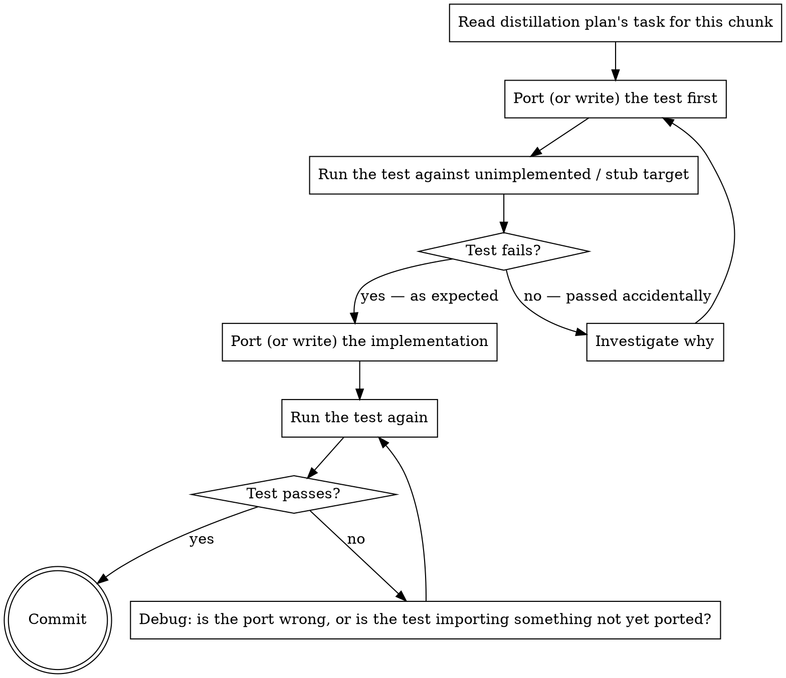

# Equivalence-TDD

The rigid TDD discipline for porting. **Tests are derived from the reference, not invented from requirements.** This is what differentiates a distillation from a from-scratch rewrite: the reference's tests (or behavior captures, or property assertions) become the acceptance criteria for the port.

Invoked by `distillation-execution`'s implementer subagent for every implementation task. Also usable directly if a developer is porting one chunk by hand.

**Announce at start:** "I'm using `equivalence-tdd` to port <chunk> with equivalence verification."

**Type:** Rigid. Follow exactly. Do not adapt away the discipline.

## The discipline

For each chunk:



## Steps

Create `TaskCreate` entries and complete in order.

### 1. Port or write the test FIRST

Choose the source for the test based on the plan's "test strategy" for this chunk:

- **port-reference-test:** open the reference's test file at the path in the plan. Copy or translate the relevant test cases to the target test framework. Adapt imports, type annotations, naming. Preserve assertions and the shape of the test data.
- **fresh-equivalence-test:** the reference has no usable tests; the plan provides input/output pairs captured from running the reference. Encode each pair as a test case. Cite the captured run in a comment.
- **property-based fallback:** the plan provides properties (sort stable, length preserved, idempotent, etc.). Encode each property as a test in the target's property-testing library (fast-check, hypothesis, proptest, …) or a hand-written generative test.

The test goes in the target project's test tree, mirroring the source structure where reasonable. The test file carries an attribution header (see `attribution-and-license`).

### 2. Run the test against an unimplemented / stub target

Run the test now. **It must fail.**

Acceptable failures:

- Module not found / import error pointing at the not-yet-ported target file. Acceptable: it proves the test is exercising the right path.
- Assertion failure showing the unimplemented stub returning the wrong thing. Acceptable.
- Compilation failure pointing at the missing target. Acceptable.

**Unacceptable outcomes:**

- The test passes. Investigate: the test is wrong (asserts on the import-error path, asserts something trivially true, or imports the reference directly instead of the target).
- The test fails for an unrelated reason (e.g., test framework misconfigured). Fix the environment, not the test.

If the test passes accidentally, **do not proceed.** Fix the test until it fails for the right reason.

### 3. Port or write the implementation

Apply the adaptations from the spec:

- Naming conventions (camelCase ↔ snake_case ↔ PascalCase).
- Type system translation (per `cross-language-notes.md` if the plan references it).
- Library substitutions per the spec's external-library plan.
- Hidden-coupling resolutions per the spec.

For `learn-then-rewrite` chunks, the implementation is **independent** — you understood the reference, now you write code that satisfies the test. You do not refer to the reference's lines while typing.

For `copy` mode, the implementation is the reference's code with adapted imports/naming. Nothing more.

For `port` mode, the implementation preserves the reference's algorithmic structure with target-idiomatic translations.

Each target file gets its attribution header (see `attribution-and-license` per-file rules) **in the same commit** as the code.

### 4. Run the test

It must pass.

If it doesn't:

- Is the port wrong? Compare the test's assertion to what the implementation produces. Debug.
- Is the test importing or invoking something not yet ported? Check the plan: are upstream chunks already done? If not, the plan ordering is wrong — escalate.
- Is the test relying on behavior the spec marked out of scope? Confirm with the spec; if intentional, mark the test as skipped with a comment pointing at the spec section.

Do **not** weaken the test to make it pass. The test is the spec.

### 5. Commit

One commit per chunk, containing:

- The new/modified test file.
- The new/modified implementation file.
- The attribution header inside each.

Commit message follows `attribution-and-license`'s convention:

```
distill(<repo>): <what was distilled>

Source: <repo>@<short-sha>:<source path>
License: <SPDX>
```

For learn-then-rewrite, use `Source-influence:` instead.

## Anti-patterns (banned)

| Symptom | Why banned | What to do |
|---------|-----------|------------|
| Skipping step 2 ("the test is obviously correct, no need to run it failing first") | Step 2 is the only thing that confirms the test exercises the right code. | Always run the test in the failing state and inspect the failure. |
| Adapting the test to make it pass | The test is the spec. Adapting it discards equivalence. | Debug the implementation; or escalate if the spec is wrong. |
| Writing fresh tests "while we're at it" | Out of scope. Equivalence first; new behavior is a separate workstream. | Note the idea in the spec's "Out of scope" section, do not implement here. |
| Committing test and implementation separately | Splits attribution and makes review harder. | Single commit per chunk. |
| Quietly downgrading from `port` to `learn-then-rewrite` mid-port | Mode shifts must be explicit. | Stop, escalate to the user, amend the spec, then continue. |
| Pasting the reference's code in learn-then-rewrite mode | Defeats the purpose of the mode and may breach the license. | If you need the reference's lines, the chunk is port mode — re-classify properly. |
| Calling the reference's code from the target instead of porting | Creates a dependency on `ref-code/` that ships nothing. | Port the code into the target's tree. |

## When the reference has no tests

The plan should already have decided: fresh-equivalence-test or property-based. If neither was specified and the chunk is `learn-then-rewrite`, the plan should authorize spot-check only — and the chunk's success criteria are documented in the spec. Spot-check is a fallback, not a default.

If you encounter a chunk in execution that the plan did not provide a test strategy for, stop and escalate — do not invent one silently.

## Cross-language specifics

When porting tests across languages:

- **Assertions** translate one-to-one (`expect(x).toBe(y)` ↔ `assert x == y` ↔ `assert.Equal(t, x, y)`).
- **Mocking** does not translate cleanly. Prefer reshaping the implementation to inject dependencies so tests don't need a mocking library. If you must mock, use the target's idiomatic mock library (per `cross-language-notes.md`).
- **Async tests** need the target's async test runner setup (`async def test_...` + pytest-asyncio, `it('...', async () => {})`, etc.).
- **Data fixtures** are usually fine to translate verbatim (JSON, dicts, arrays).
