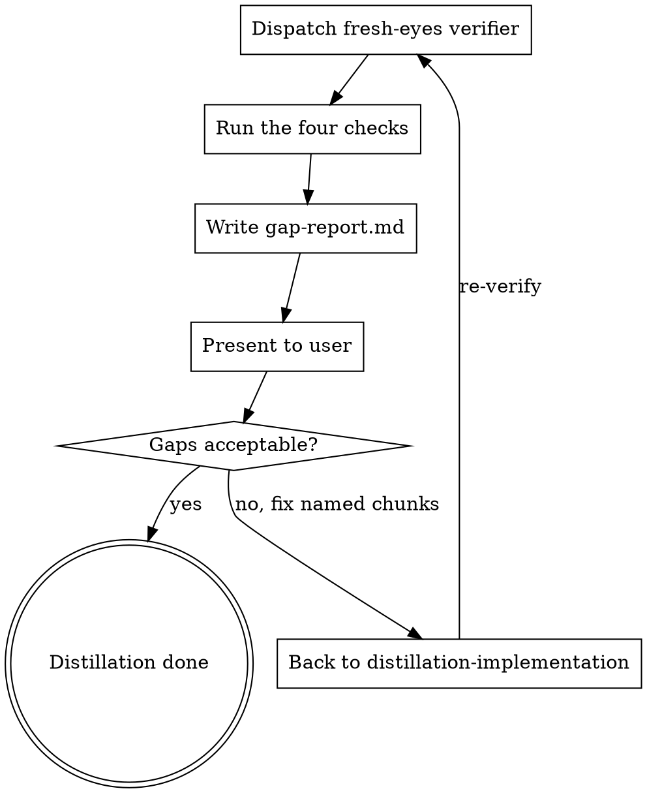

# Gap Report (Stage 5)

Verify the distillation actually captured the reference. A fresh-eyes subagent — never the implementer — compares your implementation against the distillation spec and the reference core, and writes a gap report. This is the safety net against a port that runs but is subtly wrong.

This stage is default-on and cheap (a reading-based review). It is not optional.

<HARD-GATE>
The distillation is not done until a gap-report exists and the user has accepted it. Do NOT declare the port complete on the implementer's say-so.
</HARD-GATE>

## Checklist

You MUST create a task for each of these items and complete them in order:

1. **Dispatch a fresh-eyes verifier** — a subagent that did not write the code (`./gap-report-reviewer-prompt.md`)
2. **Run the four checks** — completeness, fidelity, no-leakage, contract
3. **Write gap-report.md**
4. **Present to the user** — loop back to implementation on gaps, else done

## Process Flow

## The Process

**Dispatch a fresh-eyes verifier:**

- Use a subagent with isolated context — it must not be the agent that wrote the code. Fresh eyes catch what the implementer rationalized.
- Give it the distillation spec, the reference core paths, and the implementation paths.

**The four checks:**

- **Completeness** — is every keep-verbatim item and every chunk from the spec present in the implementation? (file:line for each)
- **Fidelity** — are the code-as-data items byte-for-byte unaltered? (no rounded constants, reworded prompts, reordered steps)
- **No-leakage** — did any of the reference's deps/framework/accidental complexity sneak in? Are seams wired to your deps?
- **Contract** — does the behavior satisfy the spec's contract and invariants? (by reading, plus any feasible spot-run)

## After the Verification

**Documentation:**

Write to `docs/code-distilling/<capability>/gap-report.md`:

- **Verdict** — fully distilled / gaps found.
- **Completeness** — keep-verbatim & chunks: present / missing (file:line).
- **Fidelity** — any altered code-as-data, with reference value vs ported value.
- **Leakage** — any reference deps or accidental complexity found.
- **Contract** — assessment + any uncertainties.
- **Gaps** — concrete list, each pointing at the chunk to fix.

**User Review Gate:**

> "Gap report written to `<path>`. [Fully distilled / N gaps found]. Please review."

If gaps: loop back to `distillation-implementation` to fix the named chunks, then re-verify. If clean: the distillation is done.

## Key Principles

- **Fresh eyes, not the implementer** — independence is the whole point
- **Don't trust the report** — verify by reading the code and the reference
- **Default-on review** — never skip it
- **Reading-based and honest** — verify by reading the port against the reference, and say so
