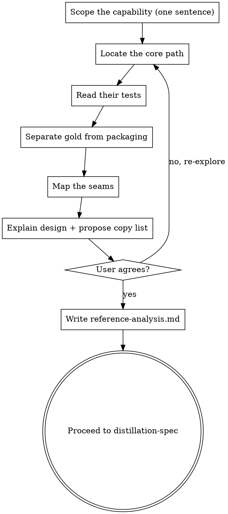

# Reference Analysis (Stage 1)

Map the **one capability** you're distilling. Understand it well enough to explain the reference's design back to the user and propose precisely what's worth copying — through natural collaborative dialogue.

Start by exploring the reference, then explain how it works in plain terms and converge with the user on the copy list. Once you agree on what to bring over, write it down so the later stages can stand on it.

<HARD-GATE>
Do NOT write the distillation spec, scaffold anything, or take any implementation action until you have presented the reference analysis and the user has approved the capability and the copy list. This applies to EVERY port regardless of how small it looks.
</HARD-GATE>

## Anti-Pattern: "It's Obvious What To Copy"

Every distillation goes through this stage. A one-file utility, a single function, a snippet — all of them. The danger of "obvious" is that the *encoded decisions* — a threshold, the order of two steps, an edge-case branch — hide in plain sight, and code that looks like packaging is sometimes the gold. The analysis can be short (a few sentences for a tiny port), but you MUST produce it and get approval.

## Checklist

You MUST create a task for each of these items and complete them in order:

1. **Scope the capability** — name it in one sentence
2. **Locate the core path** — the files/functions that actually deliver it
3. **Read their tests** — cheap signal for the edge cases the authors consider correct
4. **Separate gold from packaging** — essential vs accidental; logic vs data
5. **Map the seams** — what the core needs in, what it emits out
6. **Explain the design + propose the copy list** — dialogue, get agreement
7. **Write reference-analysis.md** — save it and get user gate approval

## Process Flow

## The Process

**Scoping the capability:**

- Name the target precisely — the specific behavior, not the whole project. "Retrieval with their re-ranking step," not "their whole library."
- A sharp name keeps you from dragging in the entire repo. If you can't say it in one sentence, you haven't scoped it yet.

**Finding the core:**

- Trace the one path that delivers the capability, from entry point to result.
- Deliberately ignore CLI, config systems, examples, telemetry, test scaffolding, backwards-compat shims. You want the lines that matter, not the thousands around them.
- Read their tests for the core — high signal for *which edge cases the authors think matter*. Skip changelog and issue archaeology; too much effort for this stage.

**Separating gold from packaging:**

Two distinctions do the heavy lifting. Apply both to every piece of the core:

- **Essential vs accidental** — the algorithm and its tricks (essential) vs their framework, config, logging, abstractions-for-their-scale (accidental). Keep essential, drop accidental.
- **Logic vs data** — control flow and structure (logic; freely rewritten later in your idioms) vs constants, thresholds, prompt templates, the *order* of steps, specific regexes/normalizations (data; empirical findings, copied verbatim).

The classic mistake is backwards: faithfully reproducing their class hierarchy (packaging) while paraphrasing a tuned prompt or rounding off a `0.83` threshold (the gold). Call out the code-as-data items explicitly — they become the spec's keep-verbatim list.

**Mapping the seams:**

- **Inputs** — what the core needs from elsewhere: a model client, a store, a DB, a config object, a data format.
- **Outputs** — what it produces and who consumes it.
- For each seam, note secret sauce (distill it) vs commodity plumbing (use your own — vector math, HTTP, JSON). The seams are where the next stage splices in your project's dependencies.

**Explaining and converging with the user:**

- Explain the reference's design in plain terms — the key moves and why they exist.
- Propose what to copy and what to leave. Ask, don't assume: the user knows their project's constraints and stack; you know the reference.
- Converge on the copy list before writing the doc. Be ready to go back and re-explore if something doesn't add up.

## After the Analysis

**Documentation:**

Write the analysis to `docs/code-distilling/<capability>/reference-analysis.md`:

- **Capability** — one sentence.
- **The core** — files/functions, what each does, the main path.
- **Their design** — how it works, the key moves, and the *why* (from code + tests).
- **Gold vs packaging** — the tricks / encoded decisions to keep; the accidental parts to drop.
- **Seams** — inputs and outputs, with secret-sauce vs commodity noted.
- **Proposed copy list** — what we bring over, what we leave behind.
- **Open questions** — anything the spec must resolve.

**User Review Gate:**

Present the analysis and confirm before proceeding:

> "Reference analysis written to `<path>`. Please review — is this the right capability, did I find the real core, and is the copy list right before we write the spec?"

Wait for the user's response. If they request changes, re-explore and update the doc. Only proceed to `distillation-spec` once the user approves.

## Key Principles

- **Scope to a capability, not a repo** — name it in one sentence
- **The gold is the encoded decisions** — keep data verbatim, rewrite logic freely
- **Explain before you extract** — dialogue first, document second
- **Find the core, ignore the packaging** — the lines that matter, not the repo around them
- **It scales down** — a tiny port gets a few-sentence analysis, but still names the capability, the gold, and the seams
