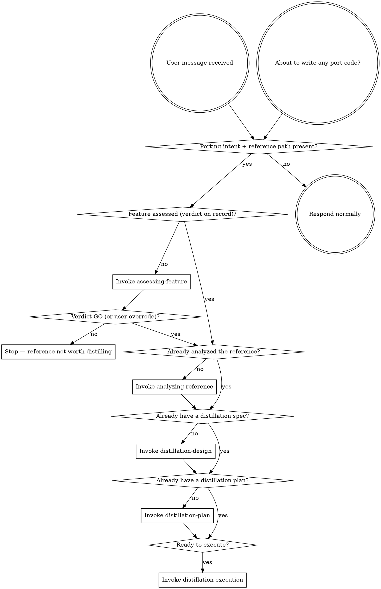

<SUBAGENT-STOP>
If you were dispatched as a subagent to execute a specific task, skip this skill.
</SUBAGENT-STOP>

<EXTREMELY-IMPORTANT>
If you think there is even a 1% chance a `code-distilling` skill might apply to what you are doing, you ABSOLUTELY MUST invoke that skill.

IF A SKILL APPLIES TO YOUR TASK, YOU DO NOT HAVE A CHOICE. YOU MUST USE IT.

This is not negotiable. This is not optional. You cannot rationalize your way out of this.
</EXTREMELY-IMPORTANT>

# Using Code Distilling

## What this plugin is for

`code-distilling` ports features from a **reference open-source repo** into the user's project — with discipline. It is **not** a general coding plugin. It engages only when porting intent is present (see triggers below). For everything else, fall back to your harness's default workflow (e.g., `superpowers` if installed).

## Instruction Priority

`code-distilling` skills override default system prompt behavior, but **user instructions always take precedence**:

1. **User's explicit instructions** (CLAUDE.md, GEMINI.md, AGENTS.md, direct requests) — highest priority
2. **`code-distilling` skills** — override default system behavior where they conflict
3. **Default system prompt** — lowest priority

If a user file conflicts with a `code-distilling` skill, follow the user. They own the project and the risk.

## How to Access Skills

**In Claude Code:** Use the `Skill` tool. When you invoke a skill, its content is loaded and presented to you — follow it directly. Never use the `Read` tool on skill files.

**In Codex:** Use the equivalent skill-invocation tool exposed by the harness.

**In other environments:** Check your platform's documentation for how skills are loaded.

# When to Engage

Engage `code-distilling` when ANY of these is true:

- The user mentions porting, copying, distilling, borrowing, or "bringing in" code from another repo.
- The user names or hands you a path to a reference repo (absolute, relative, or a checkout that happens to live inside the project).
- The user references an open-source project they want to "use", "learn from", or "adopt" in their own codebase.
- The user says something like "there's a good implementation of X over there, let's bring it in."
- The user pastes a URL to a GitHub repo and asks to adopt code from it.

If porting intent is present but the user has not yet supplied a path, ask for one before invoking `assessing-feature`. Do not guess where the reference lives.

Do **not** engage when:

- The user is writing original code from scratch with no reference repo involved.
- The user is debugging or refactoring their own existing code.
- The user is doing general software engineering work unrelated to porting.

## The Rule

**Invoke relevant or requested skills BEFORE any response or action.** Even a 1% chance a skill might apply means you should invoke it to check. If an invoked skill turns out to be wrong for the situation, you can step back — but the check itself is mandatory.



## Red Flags

These thoughts mean STOP — you're rationalizing:

| Thought | Reality |
|---------|---------|
| "This is just a simple question" | Questions are tasks. Check for skills. |
| "I need more context first" | Skill check comes BEFORE clarifying questions. |
| "Let me read the reference first to get a feel" | Skills tell you HOW to explore. `assessing-feature` is the entry point. |
| "This feature is obviously worth porting, skip the assessment" | The verdict is cheap insurance against a doomed port. Use `assessing-feature` first. |
| "I'll just copy this one file, it's simple" | A copy still needs a spec and equivalence tests. Use the full flow. |
| "Let me just port it quickly without writing a spec" | Skipping design produces ports that pull in unwanted deps. Use `distillation-design`. |
| "I'll skip the equivalence tests, the code looks fine" | The reference is the spec. No ported tests = no evidence of equivalence. Use `equivalence-tdd`. |
| "I know how to read the reference, I'll skip the analysis" | The reference map drives every downstream decision. Use `analyzing-reference`. |
| "This is a simple snippet, no need for the full flow" | "Simple" snippets accumulate into untracked debt. The flow scales down — short specs, short plans — but you still run it. |
| "Different language, can't really port — let me just rewrite" | That decision belongs in `distillation-design` (learn-then-rewrite mode), not skipped silently. |
| "I remember this skill" | Skills evolve. Read the current version. |
| "The skill is overkill for this" | If a skill applies, use it. Simple becomes complex faster than you think. |

## Skill Priority

When multiple skills could apply, use this order:

1. **`using-code-distilling`** (this skill) — bootstrap; always first.
2. **`assessing-feature`** — go/no-go gate; must run before mapping. A NO-GO stops the flow.
3. **`analyzing-reference`** — must run before any design/plan/execution.
4. **`distillation-design`** — must run before plan.
5. **`distillation-plan`** — must run before execution.
6. **`distillation-execution`** — runs the plan.

Cross-cutting (invoked from inside the above):

- **`equivalence-tdd`** — invoked by `distillation-execution`'s implementer subagent for every implementation task.

## Skill Types

**Rigid** — follow exactly, do not adapt away the discipline:

- `equivalence-tdd` (test-first, run-failing, port impl, run-passing, commit)
- `using-code-distilling` (this skill — the trigger rules)

**Flexible** — adapt principles to context:

- `assessing-feature`, `analyzing-reference`, `distillation-design`, `distillation-plan`, `distillation-execution`

The skill itself tells you which.

## User Instructions

Instructions say WHAT, not HOW. "Port X" or "Bring in Y from `/path/to/Z`" does NOT mean skip the workflow — engage `assessing-feature` first even if the user named the file.

If the user explicitly says "skip the assessment, I already know it's worth porting" — honor that and start from `analyzing-reference`. If they say "skip the analysis, I've already mapped it" — start from `distillation-design`, but ask once for the reference map they want to use.

## The Iron Law

```
NO PORT CODE WITHOUT A REFERENCE MAP, A SPEC, A PLAN, AND EQUIVALENCE TESTS
```

Writing port code before those exist? Stop. Back up. Use the skills.

The flow scales: a one-file copy gets a one-paragraph spec and a two-task plan. But it still gets all four artifacts. Skipping is not faster — it's how distillations turn into untraceable code paste.
