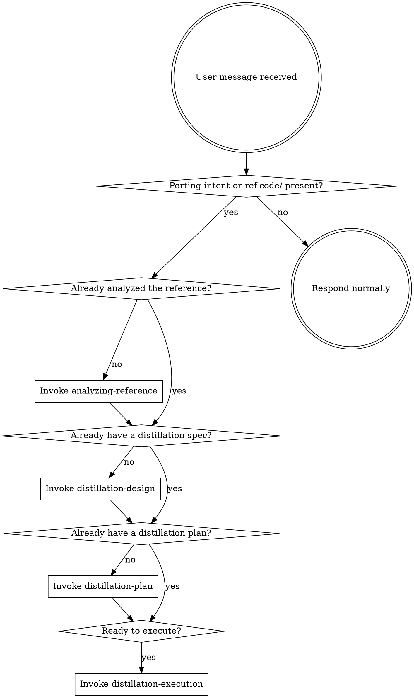

<SUBAGENT-STOP>
If you were dispatched as a subagent to execute a specific task, skip this skill.
</SUBAGENT-STOP>

<EXTREMELY-IMPORTANT>
If you think there is even a 1% chance a code-distilling skill might apply to what you are doing, you ABSOLUTELY MUST invoke the skill.

IF A SKILL APPLIES TO YOUR TASK, YOU DO NOT HAVE A CHOICE. YOU MUST USE IT.

This is not negotiable. This is not optional. You cannot rationalize your way out of this.
</EXTREMELY-IMPORTANT>

## What `code-distilling` is for

This plugin is for **porting features from a reference open-source repo into the user's project** with discipline. It is not a general coding plugin. The triggers below tell you when to engage it.

## Instruction Priority

`code-distilling` skills override default system prompt behavior, but **user instructions always take precedence**:

1. **User's explicit instructions** (CLAUDE.md, GEMINI.md, AGENTS.md, direct requests) — highest priority
2. **`code-distilling` skills** — override default system behavior where they conflict
3. **Default system prompt** — lowest priority

If the user says "skip the equivalence tests" and `equivalence-tdd` says "always run the test failing first," follow the user. They own the project.

## How to Access Skills

**In Claude Code:** Use the `Skill` tool. When you invoke a skill, its content is loaded and presented to you — follow it directly. Never use the `Read` tool on skill files.

**In Codex:** Use the equivalent skill-invocation tool exposed by the harness.

**In other environments:** Check your platform's documentation for how skills are loaded.

## When to engage `code-distilling`

Engage this plugin when ANY of these is true:

- The user mentions porting, copying, distilling, or borrowing code from another repo.
- A `ref-code/` directory exists at the project root.
- The user references an open-source project they want to "use" or "learn from" in their own codebase.
- The user says "there's a good implementation of X over there, let's bring it in."
- The user pastes a URL to a GitHub repo and asks to adopt code from it (after they place it in `ref-code/`).

Do **not** engage when:

- The user is writing original code from scratch with no reference repo involved.
- The user is debugging or refactoring their own existing code.
- The user is doing general software engineering work unrelated to porting.

In those cases, fall back to whatever workflow your harness provides (e.g., `superpowers` if installed).

## The Rule

**Invoke relevant or requested skills BEFORE any response or action.** Even a 1% chance a skill might apply means you should invoke it to check. If an invoked skill turns out to be wrong for the situation, you don't need to use it.

## Red Flags

These thoughts mean STOP — you're rationalizing:

| Thought | Reality |
|---------|---------|
| "I'll just copy this one file, it's simple" | A copy still needs license check + attribution. Use `attribution-and-license` at minimum. |
| "Let me just port it quickly without writing a spec" | Skipping design produces ports that pull in unwanted dependencies. Use `distillation-design`. |
| "I'll skip the equivalence tests, the code looks fine" | The reference is the spec. Without ported tests you have no evidence the port behaves the same. Use `equivalence-tdd`. |
| "The license is probably compatible" | Probably isn't a check. Run the compatibility check in `attribution-and-license`. |
| "I know how to read the reference, I'll skip the analysis" | The reference map drives every downstream decision. Use `analyzing-reference`. |
| "Attribution can wait until the end, I'll remember" | You won't. Headers go in the same commit as the ported code per `attribution-and-license`. |
| "This is a simple snippet, no need for the full flow" | "Simple" snippets accumulate into untracked debt. The flow scales down — short specs, short plans — but you still run it. |
| "Different language, can't really port — let me just rewrite" | That decision belongs in `distillation-design` (learn-then-rewrite mode), not skipped silently. |

## Skill Priority

When multiple skills could apply, use this order:

1. **`using-code-distilling`** (this skill) — bootstrap, always first.
2. **`analyzing-reference`** — must run before any design/plan/execution.
3. **`distillation-design`** — must run before plan.
4. **`distillation-plan`** — must run before execution.
5. **`distillation-execution`** — runs the plan.

Cross-cutting (invoked from inside the above):

- **`attribution-and-license`** — invoked by `distillation-design` (compatibility check), `distillation-plan` (per-file attribution tasks), `distillation-execution` (final attribution pass).
- **`equivalence-tdd`** — invoked by `distillation-execution`'s implementer subagent for every implementation task.

## Skill Types

**Rigid** — follow exactly, don't adapt:

- `equivalence-tdd` (the test-first-then-fail-then-pass discipline)
- `attribution-and-license` (compatibility gate, per-file headers)
- `using-code-distilling` (this skill — the trigger rules)

**Flexible** — adapt principles to context:

- `analyzing-reference`, `distillation-design`, `distillation-plan`, `distillation-execution`

The skill itself tells you which.

## User Instructions

Instructions say WHAT, not HOW. "Port X" or "Bring in Y from `ref-code/Z`" doesn't mean skip the workflow. Engage `analyzing-reference` first even if the user has already named the file.

If the user explicitly says "skip the analysis, I've already mapped it" — honor that and start from `distillation-design`, but ask once for the reference map they want to use.
