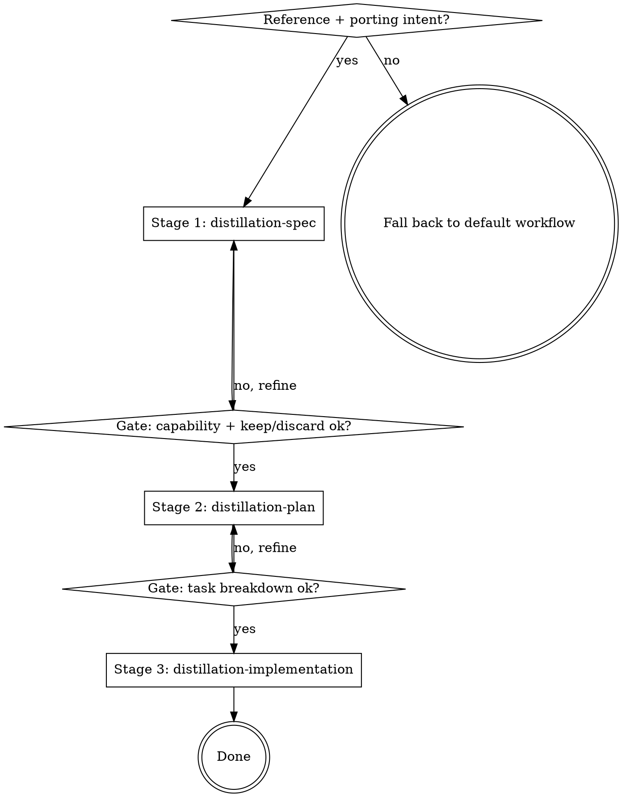

# Using Code Distilling

Distillation takes the *encoded decisions* from a reference implementation — the algorithm, the tuned constants, the hard-won edge cases — and re-expresses them in your project. Keep the gold, drop their packaging.

**The code is not the asset. The decisions encoded in the code are the asset.**

This plugin is **not** a general coding workflow. It engages only when porting intent is present. For everything else, fall back to your default workflow.

## When to Engage

Engage when ANY of these is true:

- The user wants to port / distill / copy / borrow / "bring in" a feature from another repo.
- The user hands you a path or URL to a reference repo and wants to adopt code from it.
- The user says "there's a good implementation of X over there, let's use it."

Do **not** engage when:

- The user is writing original code from scratch with no reference repo.
- The user is debugging or refactoring their own existing code.
- The work is general software engineering unrelated to porting.

If porting intent is present but no reference path is supplied yet, ask for one before starting Stage 1. Don't guess where the reference lives.

## The Flow

Three stages, with human gates after the spec and after the plan. **Each stage writes a doc** — because the implementation stage dispatches isolated-context subagents, the docs are how the stages talk to each other. A subagent that can't see your conversation can read the plan.

## The Stages

| Stage | Skill | Produces | Gate |
|-------|-------|----------|------|
| 1 | `distillation-spec` | `distillation-spec.md` — explore the reference & agree the copy list, then contract · keep-verbatim · discard · seam→your-deps · per-chunk modes | human: capability + keep/discard |
| 2 | `distillation-plan` | `distillation-plan.md` — source→target file map · bite-sized tasks with code, keep-verbatim, seams | human: task breakdown |
| 3 | `distillation-implementation` | the code + commits — execute the plan, then finish the branch | none (runs continuously) |

Artifacts live in `docs/code-distilling/<capability>/`.

## Human Judgment

Gates are **between stages** (1→2 and 2→3). Within Stage 3, subagents run **continuously** without per-task check-ins — that's by design and is not a missing gate.

## It Scales Down

A one-file copy gets a one-paragraph spec (a few-sentence exploration folded in), a two-task plan, and a quick implementation. **The docs shrink; the stages stay.** Skipping a stage is not faster — it's how a distillation turns into untraceable paste.
